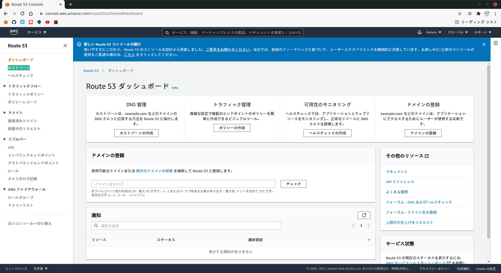
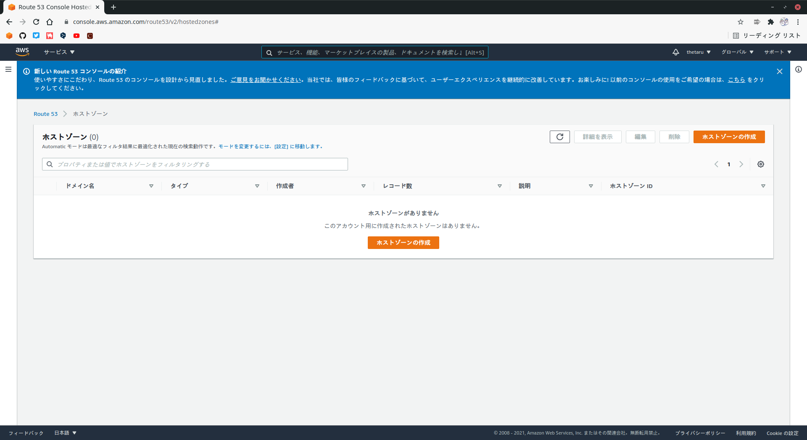
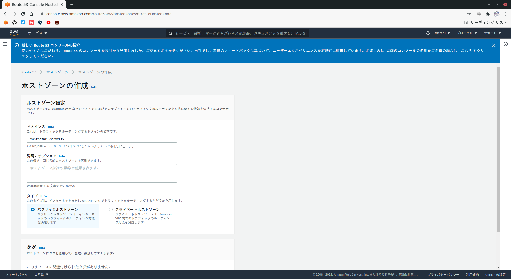
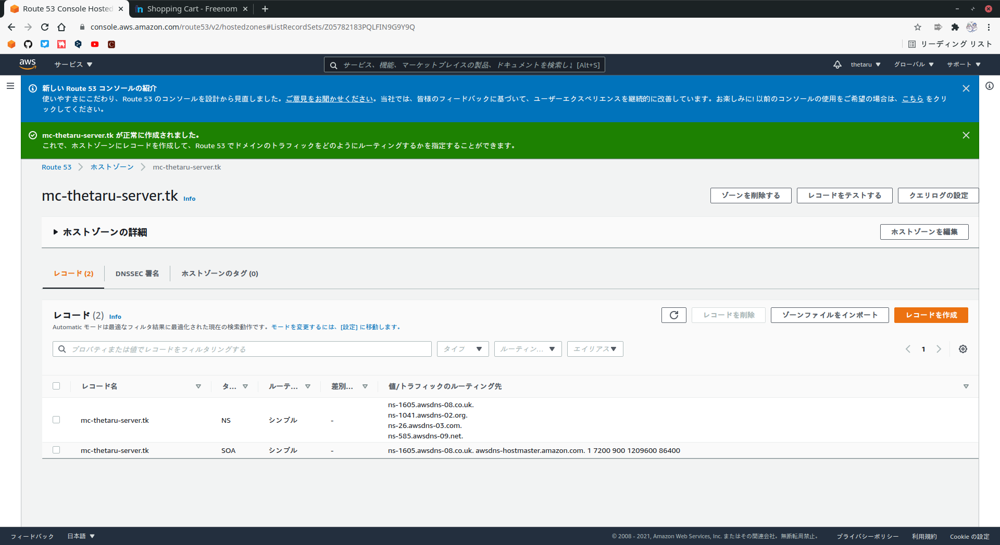
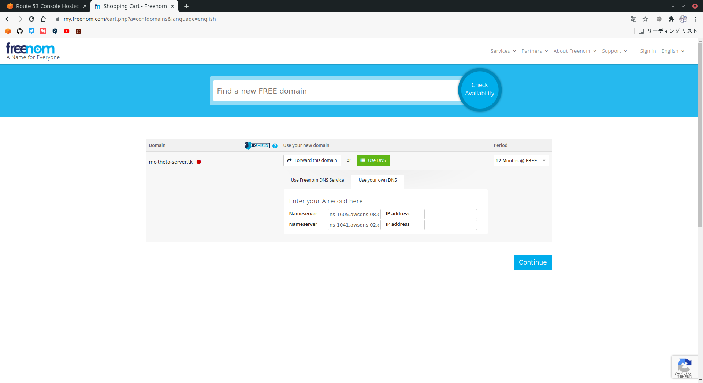

# Route53 + Freenom(無料ドメイン)連携方法
https://dev.classmethod.jp/articles/mesoko-r53-cdn/  
Freenomで取得したドメインをRoute53に委任します。
|項目|値|
|:---|:---|
|取得ドメイン名|mc-thetaru-server.tk|

## ■ Route53 - ホストゾーン作成
マネジメントコンソールから`ネットワーキングとコンテンツ配信`より`Route 53`を選択し、画面左側のホストゾーンを押します。
  

  
`ホストゾーンの作成`を押します。
  

  
`ドメイン名`を入力し、タイプを`パブリックホストゾーン`に変更します。  
> NSレコードは、サブドメインに委任する際に必要となります。
  

   
 ホストゾーンが正常に作成されていることを確認します。  
 NSレコードが作成されていることがわかります。(委任先のDNSサーバが指定されます。)
   

    
## ■ Freenom - ドメイン取得
[freenom](https://www.freenom.com/ja/index.html?lang=ja)にアクセスしてドメインを取得します。  
ここでは、取得方法については触れませんが、検索する際はFQDNで検索しないと登録できないことに注意しましょう。  
  
ドメインを選択すると次のような画面がでたら、`UseDNS`を選択しRoute53で作成されたNSレコードに登録されたDNSサーバを指定します。
  

  
以上でドメインの委任は完了です。  
これによりドメインの管理者はfreenomからRoute53のNSレコードに記載されたDNSサーバに移りました。
## ■ Route53 - DNSレコード登録
CNAMEレコード(ALIASレコード)を登録します。
