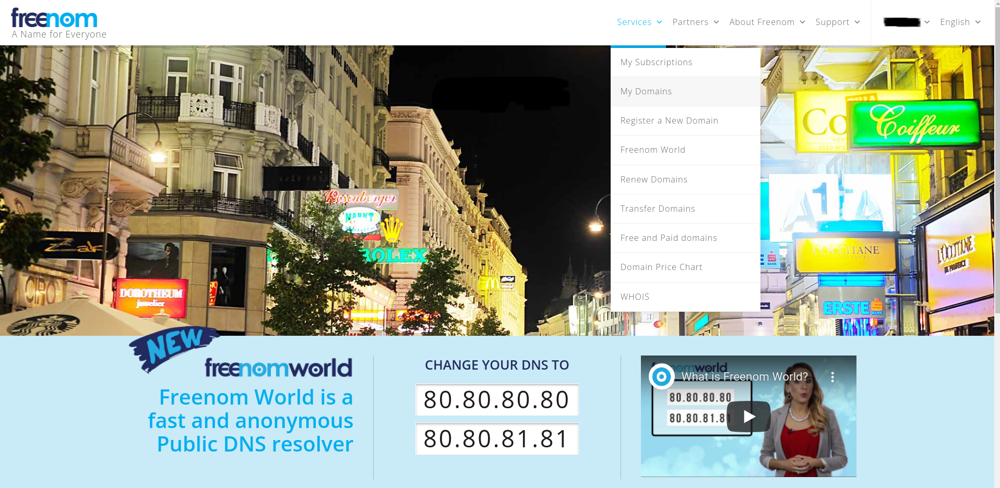
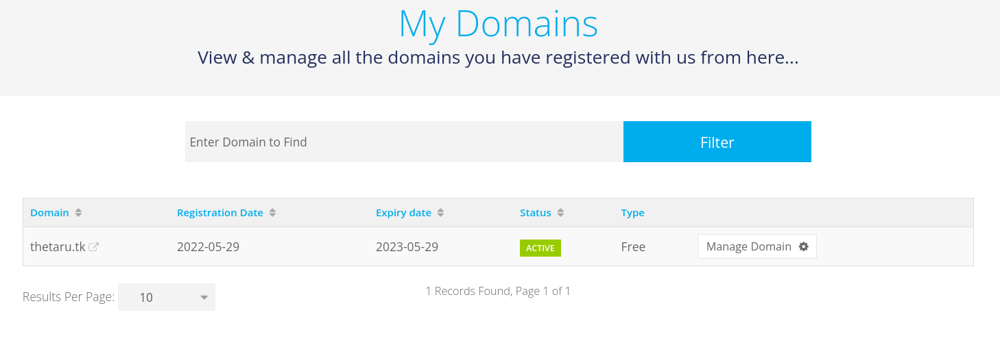
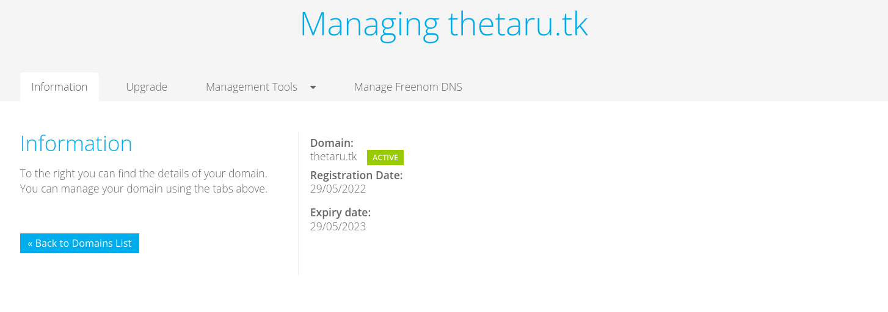
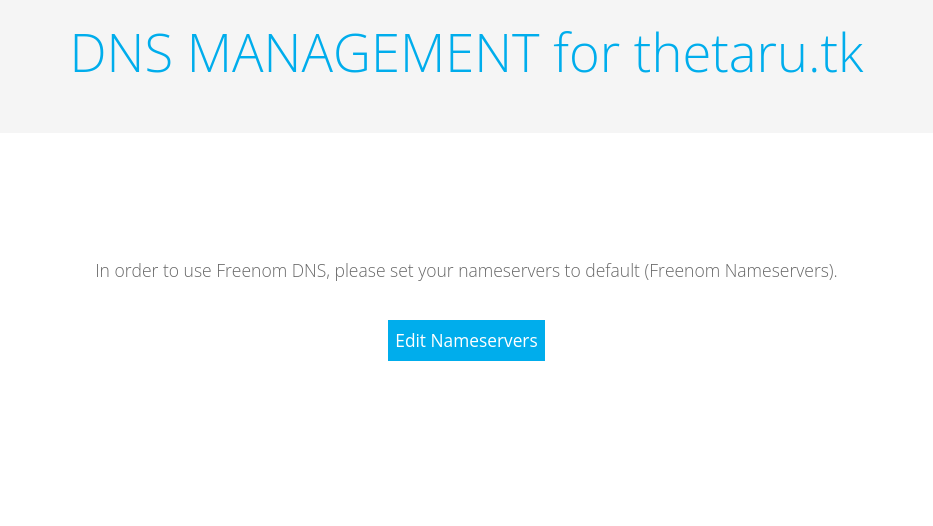
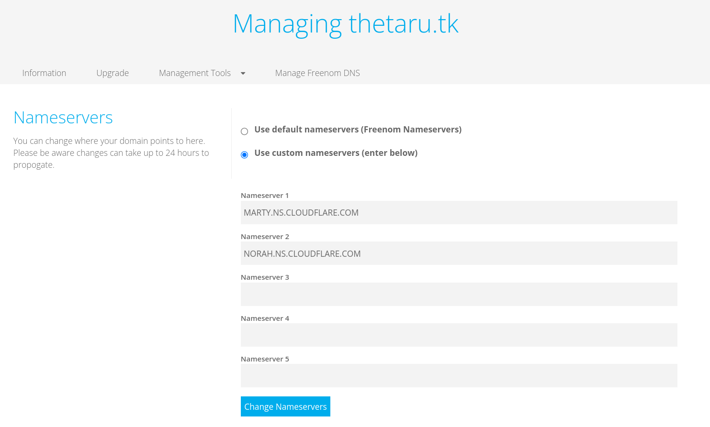

# ドメインの委任(freenom)
freenomでドメインを取得していることを前提とする。
## ■ ドメインの委任
`My Domains`をクリックする。

`Manage Domain`をクリックする。

`Manage Freenom DNS`タブをクリックする。

`Edit Nameservers`をクリックする。

`Use custom nameservers(enter below)`より委任先のDNSを指定し、`Change Nameservers`をクリックする。

