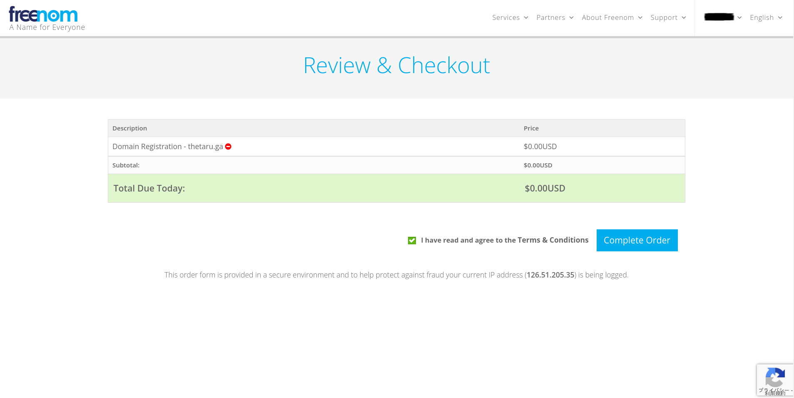

# ドメインの取得(freenom)
## ■ freenomにアクセス
以下のURLからfreenomのサイトにアクセスする。
- http://www.freenom.com/en/index.html

## ■ ドメインの取得
`Register a New Domain`をクリックする。

テキストボックスに取得したいドメイン名(e.g. thetaru.ga)を入力し、`Check Availability`をクリックする。

ドメインが取得可能であることを確認し、`Checkout`をクリックする。

ドメインの有効期限をデフォルト(3ヶ月)から12ヶ月に延長し、`Continue`をクリックする。

> **Note**  
> ドメインの取得のみを目的とするためドメインの委任設定は行わない  

ドメインの購入画面に遷移したら、チェックボタンにチェックを入れ、`Complete Order`をクリックする。

