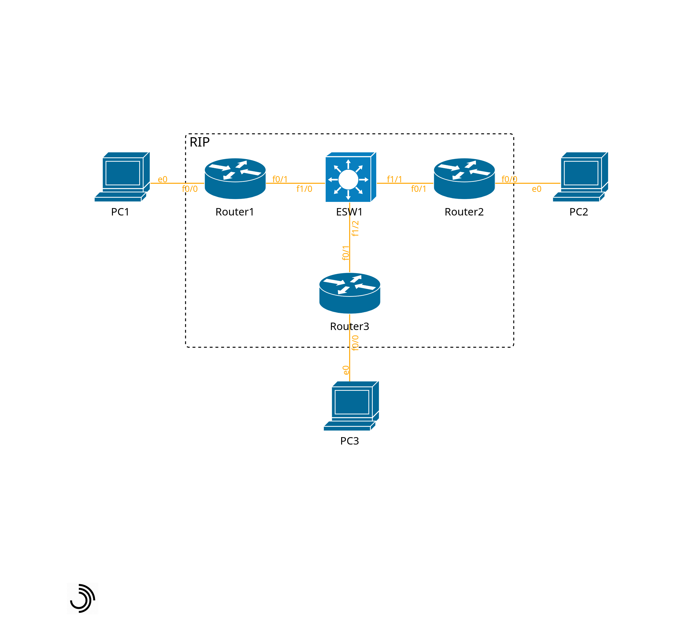

# 簡単なネットワークの構築
## ■ NW構成図

## ■ ESW1の設定
```
> enable
# configure terminal
(config)# hostname ESW1
(config-vlan)# name sample
(config-vlan)# exit
(config)# interface range FastEthernet 1/0 - 2
(config-if-range)# switchport mode access
(config-if-range)# switchport access vlan 100
(config-if-range)# speed 100
(config-if-range)# duplex full
(config-if-range)# no shutdown
```
## ■ Router1の設定
```
> enable
# configure terminal
(config)# hostname Router1
(config)# interface FastEthernet 0/0
(config-if)# ip address 192.168.1.1 255.255.255.0
(config-if)# speed 100
(config-if)# duplex full
(config-if)# no shutdown
(config-if)# exit
(config)# interface FastEthernet 0/1
(config-if)# ip address 10.10.10.1 255.255.255.0
(config-if)# speed 100
(config-if)# duplex full
(config-if)# no shutdown
(config-if)# exit
(config)# router rip
(config-router)# version 2
(config-router)# no auto-summary
(config-router)# network 192.168.1.0
(config-router)# network 10.0.0.0
```
## ■ Router2の設定
```
> enable
# configure terminal
(config)# hostname Router2
(config)# interface FastEthernet 0/0
(config-if)# ip address 192.168.2.2 255.255.255.0
(config-if)# speed 100
(config-if)# duplex full
(config-if)# no shutdown
(config-if)# exit
(config)# interface FastEthernet 0/1
(config-if)# ip address 10.10.10.2 255.255.255.0
(config-if)# speed 100
(config-if)# duplex full
(config-if)# no shutdown
(config-if)# exit
(config)# router rip
(config-router)# version 2
(config-router)# no auto-summary
(config-router)# network 192.168.2.0
(config-router)# network 10.0.0.0
```
## ■ Router3の設定
```
> enable
# configure terminal
(config)# hostname Router3
(config)# interface FastEthernet 0/0
(config-if)# ip address 192.168.3.3 255.255.255.0
(config-if)# speed 100
(config-if)# duplex full
(config-if)# no shutdown
(config-if)# exit
(config)# interface FastEthernet 0/1
(config-if)# ip address 10.10.10.3 255.255.255.0
(config-if)# speed 100
(config-if)# duplex full
(config-if)# no shutdown
(config-if)# exit
(config)# router rip
(config-router)# version 2
(config-router)# no auto-summary
(config-router)# network 192.168.3.0
(config-router)# network 10.0.0.0
```
## ■ PC1
```
> ip 192.168.1.100/24 192.168.1.1
> save
```
## ■ PC2
```
> ip 192.168.2.100/24 192.168.2.2
> save
```
## ■ PC3
```
> ip 192.168.3.100/24 192.168.3.3
> save
```
## ■ 設定の確認
### VLAN割り当ての確認
```
# show vlan-switch
```
### CDPネイバーの確認
```
# show cdp neighbors
```
### ルーティングテーブルの確認
```
# show ip route rip
```
### インターフェースの確認
```
# show interface FastEthernet 0/0
```
