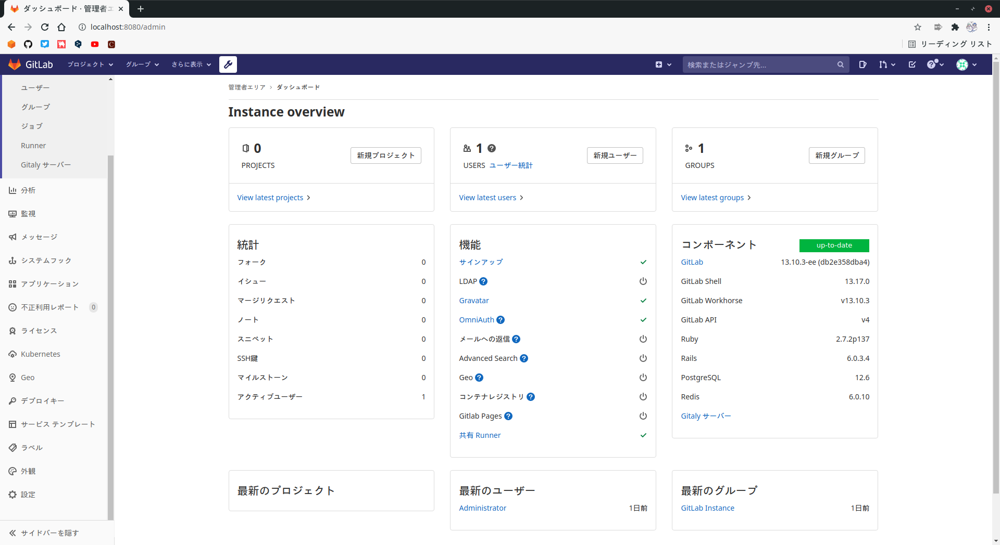
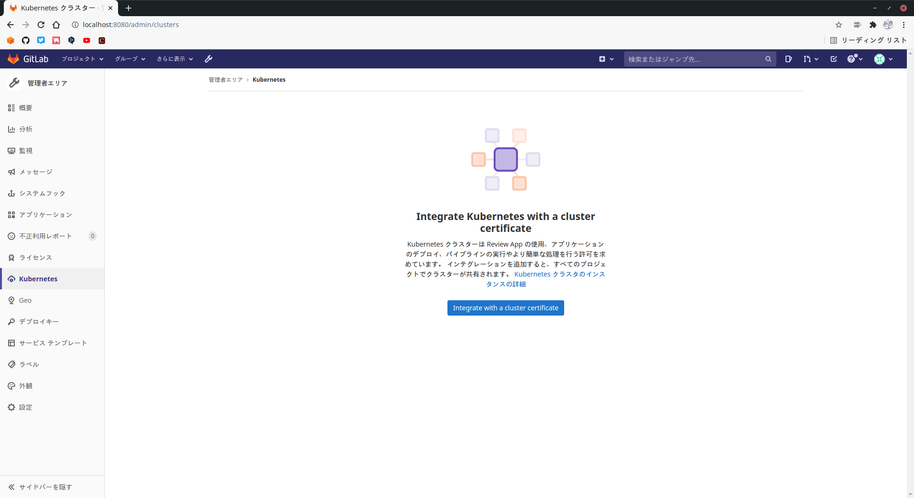
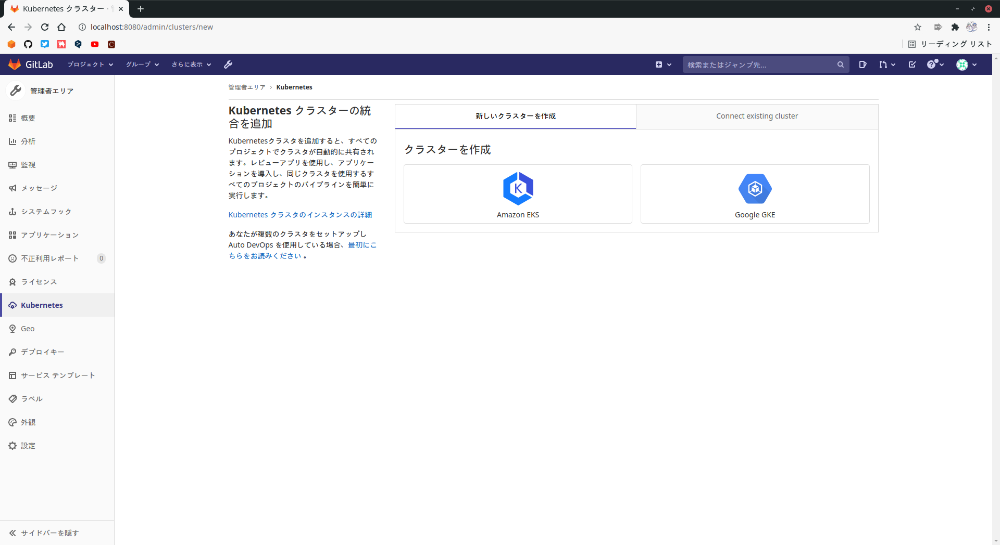
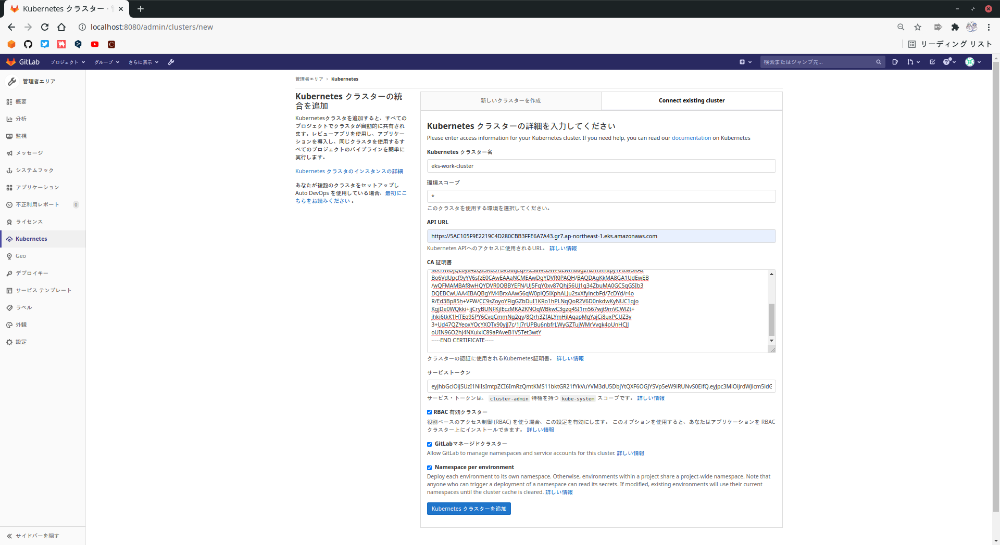

# GitLab RunnerとEKSの連携
`AWS CLI`,`AWS CDK`の設定や`EKSクラスタ`の構築がされていることを前提とします。
## ■ EKS連携のための情報取得
以下の情報をEKSクラスタから取得します。
- API URL
- シークレット名
- トークン
- CA Certificate

まずAPI URLを取得します。
```
# kubectl config view | grep server | cut -f 2- -d ":" | tr -d " "
```
シークレット名を取得します。この値は後続のコマンドで必要になります。
```
# kubectl get secrets
```
```
NAME                  TYPE                                  DATA   AGE
default-token-79tsx   kubernetes.io/service-account-token   3      13m
```
取得したシークレット名を入れて実行します。
```
# kubectl get secret default-token-79tsx -o jsonpath="{['data']['token']}" | base64 --decode
```
同様に、取得したシークレット名を入れて実行します。
```
# kubectl get secret default-token-79tsx -o jsonpath="{['data']['ca\.crt']}" | base64 --decode
```
## ■ GitLabプロジェクトとEKSクラスタを連携
### プロジェクトの作成
`新規プロジェクト`-`テンプレートから作成`-`Ruby on Rails`を選択し新規プロジェクトを作成します。  
  

  
### EKSクラスタと連携
`オペレーション`-`Kubernetes`-`Connect existing cluster`を選択肢、必要な情報を記入して登録します。
  

  
    

  
    

  
