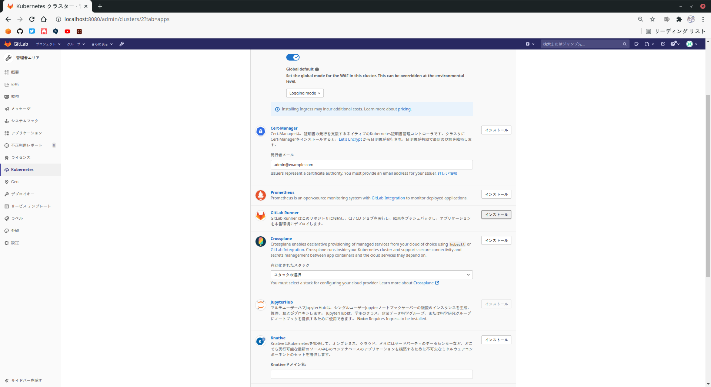
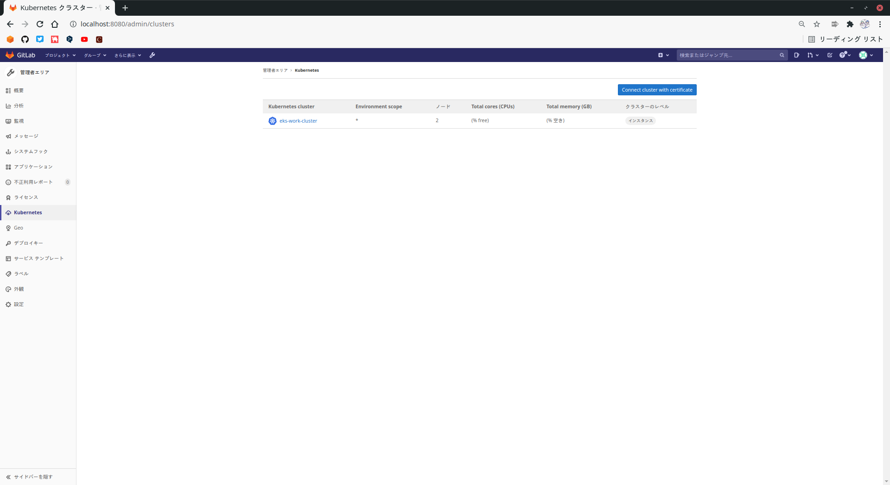

# GitLab RunnerとAWS EKSの連携
## ■ 前提条件
- AWS EKSクラスタが構築済みであること
## ■ 構成
今回はプロジェクト全体に反映される管理者エリアから設定します。(プロジェクト単位での反映もできます。)
  
管理者エリアを開き、画面左側のKubernetesを押します。
  
  
  
初回画面は下の画像になっており、`Integrate with a cluster certificate`を押します。
  
  
  
すでに構築済みのクラスタを登録するので、`Connet existing cluster`を押します。
  
  
  
クラスタ登録に必要となる情報を入力します。  
必要な情報は以下のとおりです。
- API URL
- CA Certificate
- サービストークン
  
### 情報の取得方法
#### API URL
```
# kubectl config view | grep 'server:' | tr -d ' ' | sed 's/^server://'
```
#### CA Certificate
`kubectl get secrets`で出てきたdefault-tokenから証明書を取得します。
```
# kubectl get secrets
```
```
NAME                  TYPE                                  DATA   AGE
default-token-XXXXX   kubernetes.io/service-account-token   3      50m
```
`default-token-XXXXX`から証明書を取得します。
```
# kubectl get secret default-token-XXXXX -o jsonpath="{['data']['ca\.crt']}" | base64 --decode
```
#### サービストークン
サービストークンを取得するためにまず、gitlab登録用にサービスアカウントgitlabを以下のマニフェストで作成します。
```
### FileName: gitlab-admin-service-account.yaml
apiVersion: v1
kind: ServiceAccount
metadata:
  name: gitlab
  namespace: kube-system
---
apiVersion: rbac.authorization.k8s.io/v1
kind: ClusterRoleBinding
metadata:
  name: gitlab-admin
roleRef:
  apiGroup: rbac.authorization.k8s.io
  kind: ClusterRole
  name: cluster-admin
subjects:
  - kind: ServiceAccount
    name: gitlab
    namespace: kube-system
```
作成したマニフェストを適用します。
```
# kubectl apply -f gitlab-admin-service-account.yaml
```
サービスアカウントができたので、トークンを取得します。
```
# kubectl -n kube-system describe secret $(kubectl -n kube-system get secret | grep gitlab | awk '{print$1}') | grep 'token:' | tr -d ' ' | sed 's/^token://'
```
  
GitLabに戻り、取得した情報を入力します。
  
  
  
GitLab Runnerをインストールします。
  
  
  
次のような画面になっていたら正常に登録できています。
  
  
  

