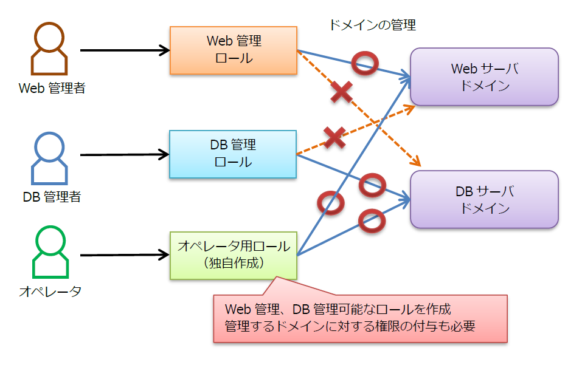
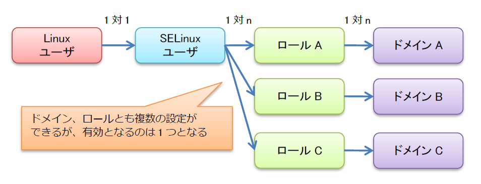

# SELinux機能の概要
## ■ アクセス制限モデル
### ● Type Enforcement (TE)
ファイルのパーミッションとは別のアクセス制御です。  
プロセスがアクセスできるリソース(ファイル、ディレクトリ、ソケットなどの総称)を制限できます。
### ● Role-based Access Control (RBAC)
ロールという役割に応じたアクセス権をユーザに付与することでアクセス制御を行います。
### ● Multi-level Security/Multi-category Security (MLS/MCS)
## ■ SELinuxコンテキスト
任意のプロセスとリソースはSELinuxコンテキストがラベル付けされています。
#### Syntax - SELinux contexts
```
<SELinux User>:<RBAC Role>:<TE Type>:<MLS/MCS Security level>
```
- ユーザ属性
> サブジェクトやオブジェクトに付けるSELinuxのユーザID
- ロール属性
> ユーザに割り当てられる権限の範囲を定義したもの  
> ロールの不要なオブジェクトにはダミーロール(object_r)を付与する
- タイプ属性
> SELinuxがアクセス可否を判定する時に使用するセキュリティ権限
- 機密ラベル
> 組織・役職などで分ける識別子

#### 例 - SELinux contexts
```
system_u:object_r:admin_home_t:s0
```
## ■ TE
### ドメインとタイプ
ドメインとタイプを使い、許可する動作をルールとして記述します。  
※ ドメインとはプロセスのタイプを指し、リソースのタイプと区別します。
### アクセス制御
ホワイトリスト方式によるアクセス制御を行います。  
「誰が」「何に対し」「何ができるか」をルールとして記述します。
#### Syntax
```
allow アクセス元ドメイン アクセスタイプ : ファイル種別 { 許可するパーミッション };
```
#### 例 - webサーバがHTML文章を読み込めるルール
```
ドメイン: httpd_t -> タイプ: httpd_sys_content_t
allow httpd_t httpd_sys_content_t : file { read };
```
## ■ RBAC
  
  
OSにログインするLinuxユーザにSELinuxの制限を掛けるには、LinuxユーザとSELinuxユーザをマッピングします。  
  

  
## ■ MLS/MCS
## ■ ref
https://www.ffri.jp/assets/files/monthly_research/MR201406_A%20Re-introduction%20to%20SELinux_JPN.pdf  
https://www.google.com/url?sa=t&source=web&rct=j&url=https://www.nic.ad.jp/ja/materials/iw/2017/proceedings/d1/d1-3-moriwaka-1.pdf&ved=2ahUKEwjd3q7mlrLxAhV3wosBHcYDDS8QFjAAegQIAxAC&usg=AOvVaw0TUVpDyiwyrAjDCCapIycc  
https://www.google.com/url?sa=t&source=web&rct=j&url=https://access.redhat.com/documentation/ja-jp/red_hat_enterprise_linux/8/pdf/using_selinux/Red_Hat_Enterprise_Linux-8-Using_SELinux-ja-JP.pdf&ved=2ahUKEwjC-4D9lrLxAhUUJaYKHZclBhUQFjABegQIBRAC&usg=AOvVaw1eYgLHrS5yWnIv_lVpzXOF&cshid=1624603320845
