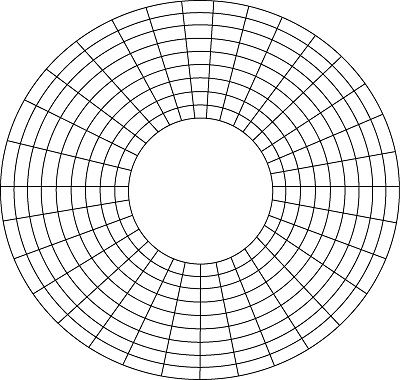
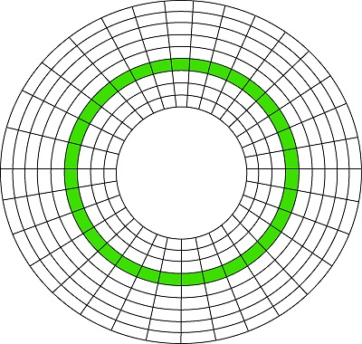
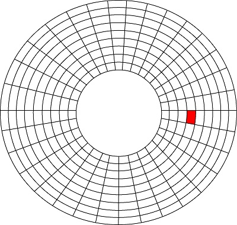
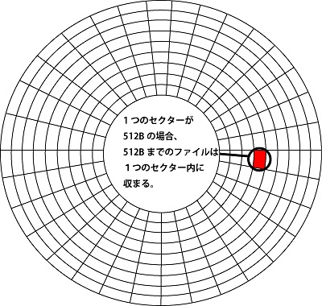
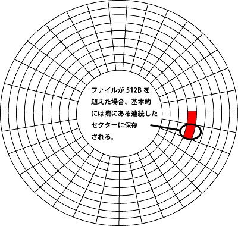
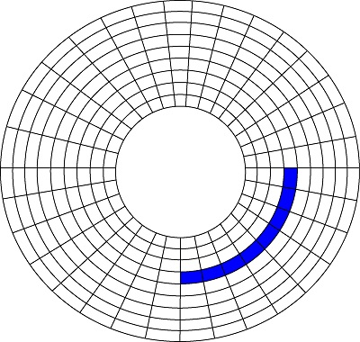

# NTFSのサイズ上限について
## クラスタサイズとは
windowsのドキュメントによると...
> windowsで使用されるすべてのファイルシステムでは、クラスターサイズ(アロケーション ユニット サイズ)に基づいて、ハードディスクを整理します。  
> クラスターサイズは、ファイルを保持するために使用できるディスク領域の最小量を表します。

だそうです。  
具体的なところでピンとこないので解説していきます。
## HDDの記録面
HDDの記録面を理解するには4つのポイントがあります。
- プラッタ
- トラック
- セクタ
- アロケーションユニット(クラスタ)

### プラッタ
プラッタとは、HDDにデータを記録する円盤のことです。(磁気ディスクとも言います。)
  

  
※ 図では、内周も外周も一定の区間で区切られていますが、実際はもっと細かく区切られています。  
※ また、内周のセクター数より外周のセクター数のほうが多いです。
### トラック
トラックとは、、ドーナツ状に分割された緑色の部分の記録領域のことです。
  

  
### セクター
セクターとは、データを記録する最小単位(通常は、1セクターあたり512バイト記録できる)で、トラック上の赤色の部分の事を言います。
  

  
※ Windowsのセクターには、512セクターと4Kセクターというものがあります。  
※ 512セクター: 1セクターあたり512バイト記録できる  
※ 4Kセクター : 1セクターあたり4096バイト記録できる  
  
512セクターを例にファイルを保存したときの動作を見てみましょう。  
1つのセクターが512バイトの場合、512バイトまでのファイルは下図のように1つのセクターに収まります。  
(つまり、保存するファイルが512バイト未満だと差分バイト分が使われません。これがサイズとディスク上のサイズの違いとして出る。)
  

  
513バイト以上のファイルに関しては１つのセクターに収まりません。  
収まりきらなかった残りの1バイトのファイルは、基本的には隣にある２個目のセクターに保存されます。
  

  
２個目のセクターにも収まりきらない場合は、３個目、４個目のセクターに順々に保存されていきます。
### アロケーションユニット(クラスタ)
クラスターとは、セクターの合計単位の事で青色の部分の事を言います。  
  

  
複数のセクターにファイルが保存され、複数のセクターの事をアロケーションユニット(クラスター)と言います。  
  
クラスターの中には、更に細分化されたセクターがあるイメージになります。
```
  +----------+----------+----------+----------+----------+----------+----------+----------+
  |  sector  |  sector  |  sector  |  sector  |  sector  |  sector  |  sector  |  sector  |
  |          |          |          |          |          |          |          |          |
  | 512 Byte | 512 Byte | 512 Byte | 512 Byte | 512 Byte | 512 Byte | 512 Byte | 512 Byte |
  +----------+----------+----------+----------+----------+----------+----------+----------+
  |                                                                                       |
  |                                   Cluster 4096 Byte                                   |
  |                                                                                       |
  +---------------------------------------------------------------------------------------+
```
### ファイルを保存したときの挙動
例として、1つのセクターが512バイトでアロケーションユニットが4096バイトのHDDを考えます。  
セクターはデータを記録する最小単位で、保存したファイルは全てセクターに保存され、ファイルは(セクターで管理するのではなく)クラスター単位で管理しています。
#### ■ ファイルサイズ: 4096バイトのファイルを保存した場合
4096バイトのファイルを512バイトごとに分割します。  
今回の場合は、アロケーションユニットサイズとファイルの容量が4096バイトなのでピッタリ8個のセクターに収まります。(実際はそんなきれいにはなりませんが...)

#### ■ ファイルサイズ: 1バイトのファイルを保存した場合
保存するファイルは1バイトなので512バイトで分割せずとも、1つのセクターに収まります。  
残りの4096バイトのセクターは、使用できると思いがちですがファイルを削除しない限り使用できません。  
1バイトのファイルだったとしても、フィあるをクラスターで管理しているので4096バイトと認識してしまいます。

#### ■ ファイルサイズ: 513バイトのファイルを保存した場合
513バイトのファイルを512バイトで分割すると、512バイト + 1バイト となります。  
つまり、2つのセクターがつかわれます。  
513バイトのファイルはクラスターで管理されているので、1バイトのときと同様に4096バイトとして認識されます。
  
以上で、サイズとディスク上のサイズの違いが具体的にわかったと思います。  
※ サイズは実サイズ で ディスク上のサイズはアロケーションユニットサイズ です。

### なんでセクターで管理しないの?
セクターでファイルを管理すると、1つのファイルが細かすぎるのとファイルが連続していないこともあるため、様々なセクターにアクセスする必要がでるからです。  
断片化もひどいことになりそうですし...  
その結果、ファイルへのアクセス(読み書きなど)の時間がかかりパフォーマンスに悪影響を及ぼします。
## クラスタサイズの確認方法
C:ドライブのクラスタサイズを確認します。
```
> chkdsk c:
```
