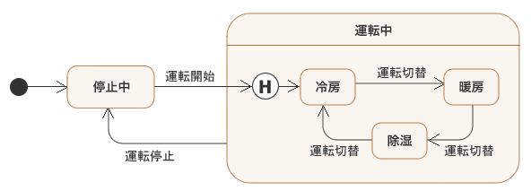

# State
## ■ 概要
Stateパターンとは、「状態」をクラスとして表現するパターンです。  
ここでは、以下の状態遷移図を持つ有限状態機械(FSM)を実装します。

  

- 状態
  - 停止中(初期状態)
  - 運転中
    - 冷房(初期状態)
    - 暖房
    - 除湿

- イベント
  - 運転開始
  - 運転停止
  - 運転切替

※ 運転中から停止中に戻る時にサブ状態は記憶され、次回運転中状態になった時は前回のサブ状態になる

## ■ 構成ファイル
|ファイル名|説明|
|:---|:---|
|FSM.h|FSMクラスを定義する|
|State.h|状態クラスを定義する|
|FSM.c|FSMクラスを実装する|
|State.c|状態クラスを実装する|
|SubState.c|サブ状態クラスを実装する|
|main.c|FSMクラスを使用するmain関数を記述する|
