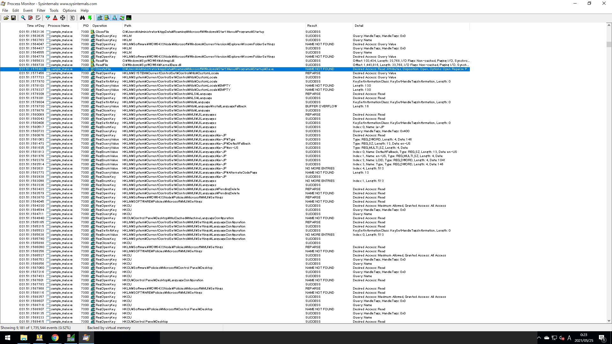
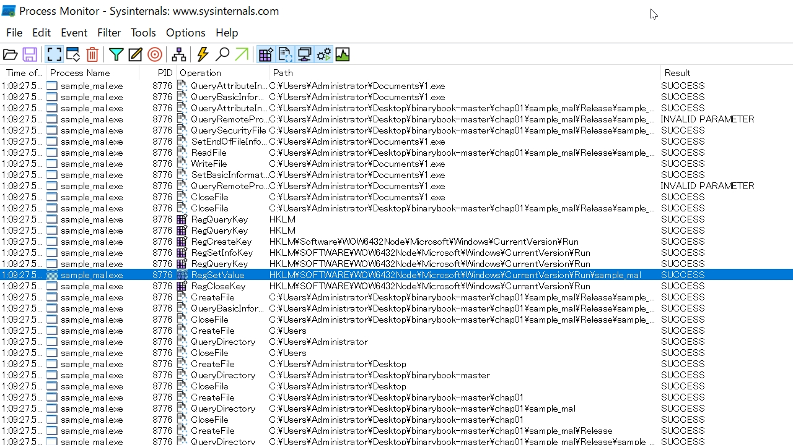
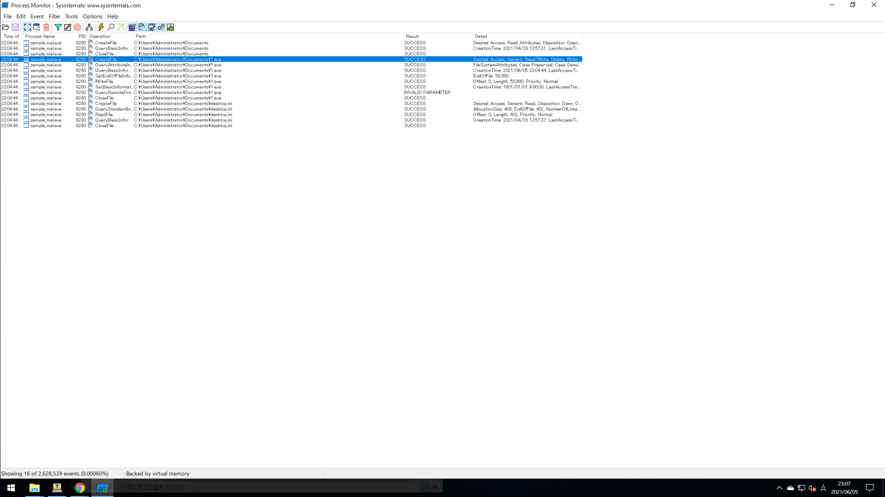
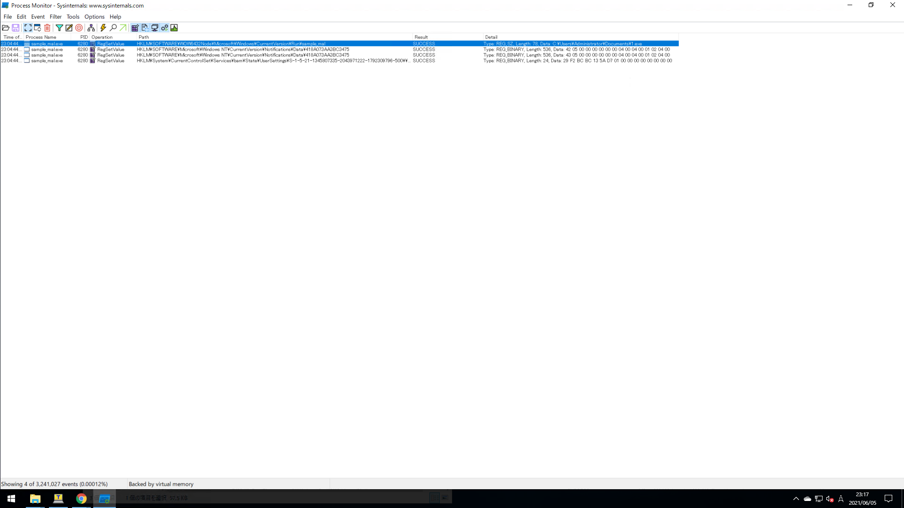

# 1.1 まずは解析の流れを体感してみよう
この章では、次の3点に注目して解析する。
- ファイルの作成/変更/削除を行う
- レジストリキーの作成/変更/削除
- ネットワーク通信

これらを監視した状態でプログラムを実行した際の動きをみる。  
そのために次の3つのツールを使用する。
- Stirling (バイナリエディタ)
- Process Monitor (ファイルとレジストリの監視)
- Wireshark (ネットワークの監視)

サンプルファイルは、以下からダウンロードできる。
```
https://github.com/kenjiaiko/binarybook
```

今回は`chap01\sample_mal\Release\sample_mal.exe`を解析する。  
実行できない場合は、vcredist_x86.exeを[MS公式サイト](https://www.microsoft.com/en-us/download/details.aspx?id=26999)よりインストールすること。  
  
`sample_mal.exe`を実行すると、`Hello Malware!`という文字列が書かれたウィンドウが表示される。  
そのウィンドウを閉じると、`sample_mal.exe`自体が消えていることがわかる。  

## ■ Process Monitorのログから挙動を確認する
Process Monitorを実行した後、ログを確認する。  
  

  
Process Monitorのログを追うと、以下の実行ファイルへCreateFileでアクセスする箇所が見つかる。  
```
C:\Users\<User Name>\AppData\Roaming\Microsoft\Windows\Start Menu\Programs\Startup\0.exe
```
`Process Name`や`Operation`でフィルタするとCreateFile、WriteFile、CloseFileの順番に呼び出されている。  
このことから、スタートアップフォルダに`0.exe`というファイルが書き込まれたことがわかる。  

## ■ レジストリへのアクセスから読み取れること
次はレジストリアクセスを確認する。  
Process Monitorが出力するログで`Process Name`がsample_mal.exe、`Operation`がRegSetValueであるものを探す。  
先ほどと同様にログをフィルタすると見つけやすくなる。  
  

  
解析対象がファイルの生成(CreateFile、RegCreateKey)や値の書き込み(WriteFile、RegSetValue)をする行為は明らかに怪しいためその周辺から調査するのは自然である。  
次は`Operation`がRegSetValueであるときの`Path`の値である。  
x64の場合
- HKLM\Software\Microsoft\Windows\CurrentVersion\Run\sample_mal

x86の場合
- HKLM\SOFTWARE\WOW6432Node\Microsoft\Windows\CurrentVersion\Run\sample_mal

`HKLM\SOFTWARE\WOW6432Node\Microsoft\Windows\CurrentVersion\Run`以下に`sample_mal`というレジストリキーを作成していることがわかる。  
  
Windows再起動時に実行するプログラムは、次のいずれかのレジストリに登録される。  
x86の場合
- HKLM\Software\Microsoft\Windows\CurrentVersion\Run
- HKCU\Software\Microsoft\Windows\CurrentVersion\Run
- HKLM\Software\Microsoft\Windows\CurrentVersion\RunOnce
- HKCU\Software\Microsoft\Windows\CurrentVersion\RunOnce

x64の場合
- HKLM\Software\WOW6432Node\Microsoft\Windows\CurrentVersion\Run
- HKCU\Software\WOW6432Node\Microsoft\Windows\CurrentVersion\Run
- HKLM\Software\WOW6432Node\Microsoft\Windows\CurrentVersion\RunOnce
- HKCU\Software\WOW6432Node\Microsoft\Windows\CurrentVersion\RunOnce

※ 32bit環境と64bit環境で一部パスが異なることに注意する
  

  
また、`C:\Users\<User Name>\Documents`以下に1.exeというファイルを作成している。  
この1.exeも、0.exe同様、sample_mal.exeのコピーである。  
  

  
実際、1.exeのパスが(RegSetValueで)レジストリ`HKLM\Software\WOW6432Node\Microsoft\Windows\CurrentVersion\Run`へ登録されている。  
確認にはregeditでレジストリを見てもよい。

## ■ リバースエンジニアリングとは
以上の結果から、sample_mal.exeは次のことを行うプログラムだとわかった。
- 再起動時に実行されるようレジストリを書き換える
- 再起動時に実行されるようスタートアップに自信をコピーする

今回の場合は、ネットワーク通信が発生していないためWiresharkを必要としなかった。  
  
このように、ソフトウェアを解析し、動作を解明していくことをリバースエンジニアリングという。
