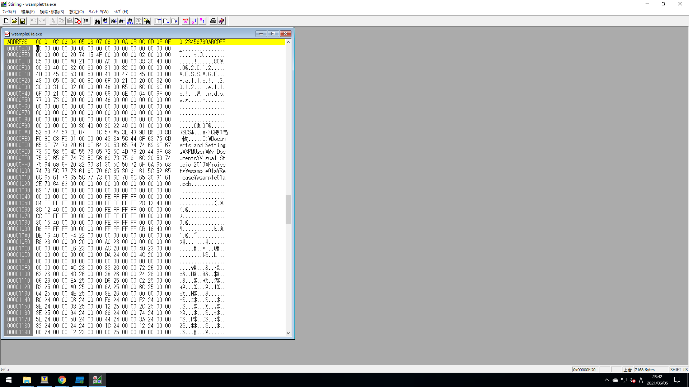
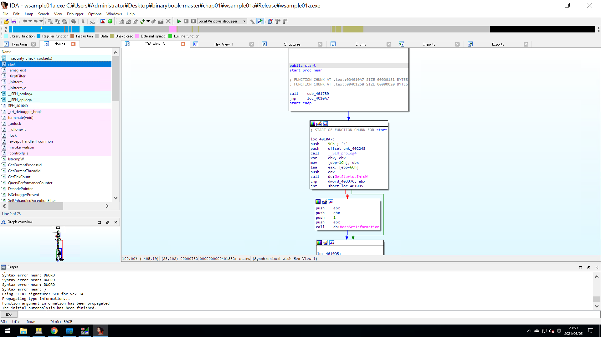
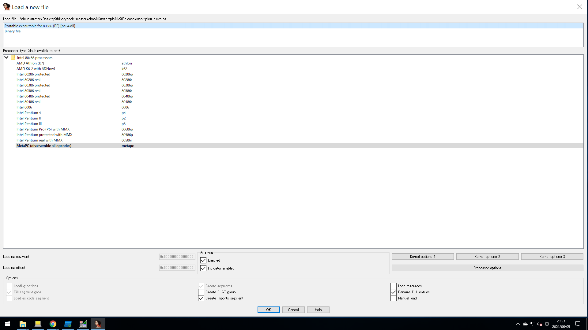
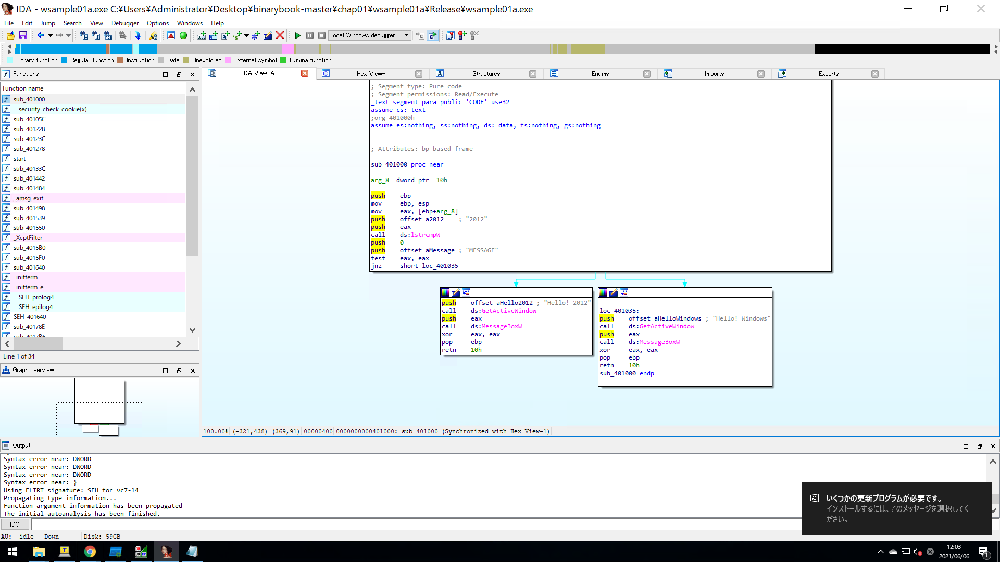

# 1.2 静的解析をやってみよう
## ■ 静的解析と動的解析
ソフトウェアを解析する手法は大きく`静的解析`と`動的解析`の2つに分けられる。
- 静的解析
> 対象となるプログラムを実行せずに解析する
- 動的解析
> 対象となるプログラムを実行しながら解析する

1.1章でsample_mal.exeに対して行った手法は動的解析である。  
静的解析では以下のような手法となる。
- 逆アセンブルしたコードを読む
- 実行ファイルの中から文字列を抽出し、どのような単語が使われるか調べる

それでは、`chap01\wsample01a\Release`にあるサンプルプログラム`wsample01a.exe`を静的解析していく。  

## ■ バイナリエディタでファイルの中身を眺めてみる
バイナリエディタ(Stirlingを使うこととする)でwsample01a.exeを開く。
  

  
Stirlingでwsample01a.exeを開くと、16進数のバイト列が表示される。  
これはPEフォーマットといい、Windowsの実行ファイル形式にならったデータ列である。  
  
ざっと読んでみると、色々な文字列(例えば、Helloやファイルパス、モジュール名など)が見けることができる。

## ■ アセンブラを読めなくても解析はできる
次は、wsample01a.exeをIDA Freeware(version 7.6)を使って逆アセンブルしていく。  
IDAのアイコンへwsample01a.exeをドラッグすると次のような画面が表示される。  
  

  

  
画面左側のFunctionsというウィンドウの一番上(sub_401000)をダブルクリックすると、逆アセンブルされたコードがIDA View-Aウィンドウに表示される。
  

    
なお、表示形式を右クリックして表示されるメニューから`Text view`もしくは`Graph view`を選択することで変えることができる。
