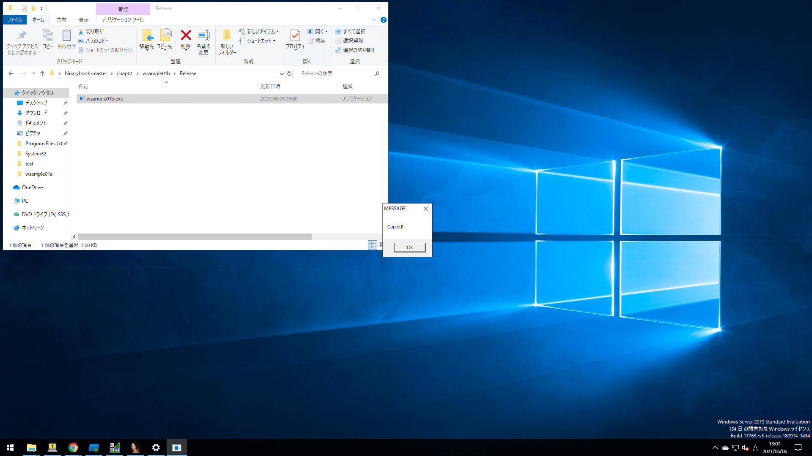
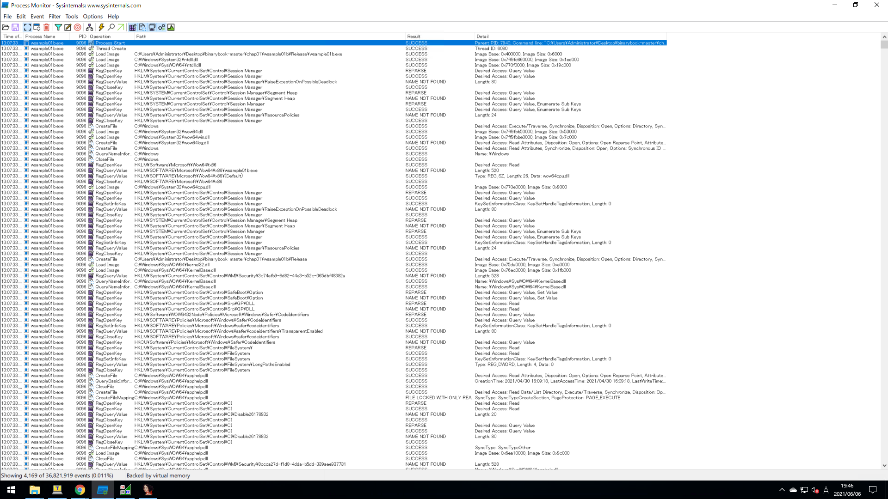
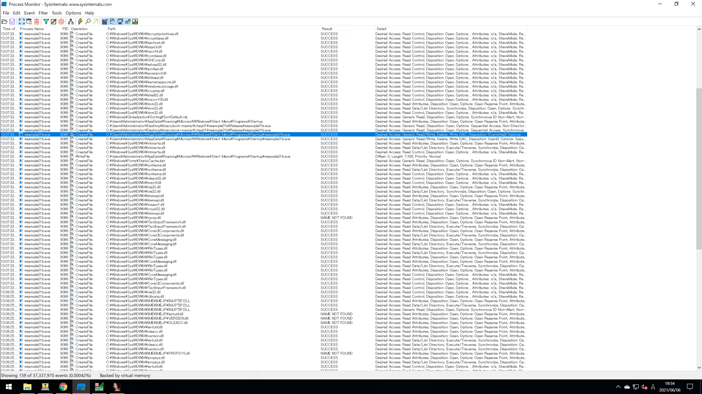

# 1.3 動的解析をやってみよう
## ■ Process Monitorのフィルタルールを設定する
静的解析に対して、対象のプログラムを実行しながらその動作を追うことを動的解析というのだった。  
- デバッガを使って処理を追跡する
- ファイルやレジストリアクセスのログを取得する
- ネットワークのパケットをキャプチャする

`chap01\wsample01b\Release`にあるサンプルプログラムwsample01b.exeを解析する。  
実際に実行してみると次のように表示される。  
  

  
`Copied`と表示されるだけで、裏で何をしているか分からないので調べていく。  
Process Monitorを起動し、フィルター機能を使って`Process Name`が`wsample01b.exe`であるログのみに絞って出力する。  
  

  
次に`Operation`が`CreateFile`であるという条件も加えてフィルターする。  
  

  
ログを眺めると、wsample01b.exeが以下のファイルへアクセスしていることがわかります。
```
C:\Users\<User Name>\AppData\Roaming\Microsoft\Windows\Start Menu\Programs\Startup
```
実際にスタートアップフォルダを開くと、wsample01b.exeがあることがわかる。

## ■ デバッガの役割とは
## ■ IDAでより詳細な動作を見極める
wsample01b.exeをIDAのアイコンにドラッグする。 
  

  
メイン関数(sub_401000)の逆アセンブルされたコードは以下の通りである。
```
00401000 sub_401000      proc near               ; CODE XREF: sub_401080↓p
00401000
00401000 var_2004        = byte ptr -2004h
00401000 var_1004        = byte ptr -1004h
00401000 var_4           = dword ptr -4
00401000
00401000                 push    ebp
00401001                 mov     ebp, esp
00401003                 mov     eax, 2004h
00401008                 call    __alloca_probe
0040100D                 mov     eax, ___security_cookie
00401012                 xor     eax, ebp
00401014                 mov     [ebp+var_4], eax
00401017                 push    1000h
0040101C                 lea     eax, [ebp+var_2004]
00401022                 push    eax
00401023                 push    0
00401025                 call    ds:GetModuleFileNameW
0040102B                 lea     ecx, [ebp+var_1004]
00401031                 push    ecx
00401032                 push    0
00401034                 push    0
00401036                 push    7
00401038                 push    0
0040103A                 call    ds:SHGetFolderPathW
00401040                 push    offset aWsample01bExe ; "\\wsample01b.exe"
00401045                 lea     edx, [ebp+var_1004]
0040104B                 push    edx
0040104C                 call    ds:lstrcatW
00401052                 push    0
00401054                 lea     eax, [ebp+var_1004]
0040105A                 push    eax
0040105B                 lea     ecx, [ebp+var_2004]
00401061                 push    ecx
00401062                 call    ds:CopyFileW
00401068                 mov     ecx, [ebp+var_4]
0040106B                 xor     ecx, ebp
0040106D                 xor     eax, eax
0040106F                 call    @__security_check_cookie@4 ; __security_check_cookie(x)
00401074                 mov     esp, ebp
00401076                 pop     ebp
00401077                 retn
00401077 sub_401000      endp
```
`00401062                 call    ds:CopyFileW`の箇所でファイルコピーを行っているように見える。

## ■ 逆アセンブルされた処理を分析する
00401000以降の処理を眺めていくと、関数の読み出しは次のように実行されていることがわかる。
1. 00401025                 call    ds:GetModuleFileNameW
2. 0040103A                 call    ds:SHGetFolderPathW
3. 0040104C                 call    ds:lstrcatW
4. 00401062                 call    ds:CopyFileW

ある程度、アセンブラコードのやっていることを推測することができたらステップ実行しつつ検証していく。  
アドレス0040100の行を選択してブレークポイントをセット(右クリック-Add breakpoint)する。  
あとはステップ実行していけば、1命令ずつ処理を進めることができる。
