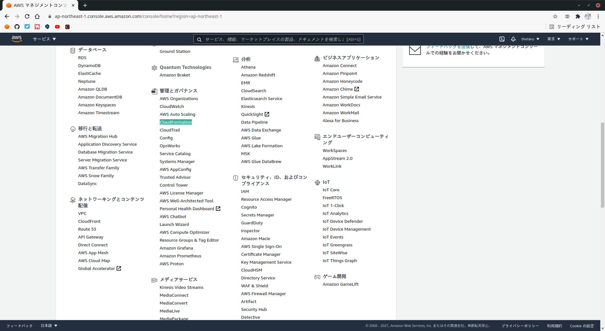
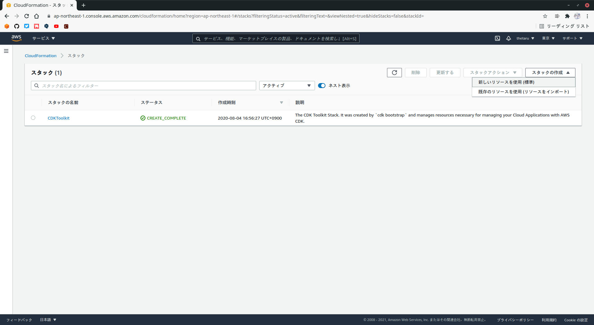
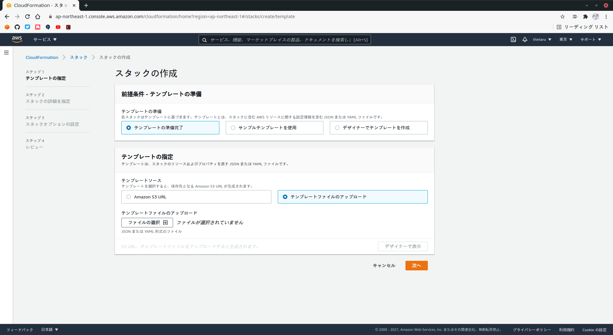
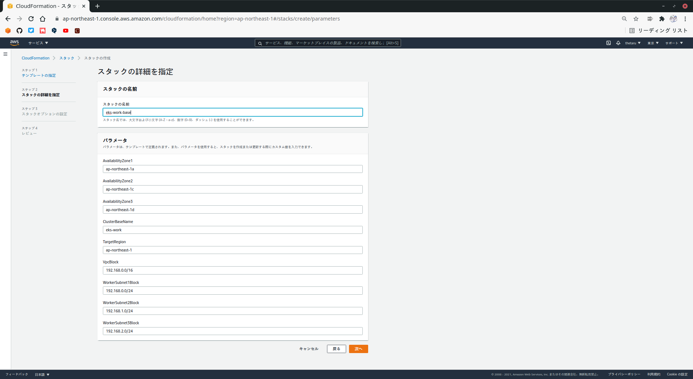

# EKSクラスタ構築
## 2-2-1 ベースリソースの構築
### ■ 利用ツールの導入
以下の手順を実行するには、次のツールを作業端末に導入しておく必要があります。
- AWS CLI
- eskctl
- kubectl
- Git

### ■ 構築情報
#### 仮想環境のセットアップ
```
### Python仮想環境管理用ディレクトリを作成
# mkdir -p /opt/python/venv
# cd /opt/python/venv

### 仮想環境作成
# python3 -m venv aws_eks

### 仮想環境をアクティベート(以後抜けない限り 仮想環境のPythonが実行される)
# source aws_eks/bin/activate
```
#### AWS CLIの導入
```
### パッケージのダウンロードと解凍
# curl "https://awscli.amazonaws.com/awscli-exe-linux-x86_64.zip" -o "/tmp/awscliv2.zip"
# unzip /tmp/awscliv2.zip

### インストーラの実行
# sudo ./aws/install
```
#### eksctlの導入
```
# curl --silent --location "https://github.com/weaveworks/eksctl/releases/latest/download/eksctl_$(uname -s)_amd64.tar.gz" | tar xz -C /tmp
# sudo mv /tmp/eksctl /usr/local/bin
```
#### kubectlの導入
AWSで配布しているkubectlパッケージを使用します。[ここ](https://docs.aws.amazon.com/ja_jp/eks/latest/userguide/install-kubectl.html)を参照してください。
```
# curl -o kubectl https://amazon-eks.s3.us-west-2.amazonaws.com/1.19.6/2021-01-05/bin/linux/amd64/kubectl
# chmod +x ./kubectl
# mkdir -p $HOME/bin && mv ./kubectl $HOME/bin/kubectl && export PATH=$PATH:$HOME/bin
# echo 'export PATH=$PATH:$HOME/bin' >> ~/.bashrc
# kubectl version --short --client
```
### ■ ベースリソースの作成手順
CloudFormationを用いてVPCなどのベースリソースの作成を行います。  
マネジメントコンソールでCloudFormationのページに移動しましょう。  
  

  
CloudFormationのページを開くと、次のような画面が表示されます。
  

  
`スタックの作成` - `新しいリソースを使用`を押して、ベースリソース作成のテンプレート選択画面に移動します。
※ スタックとは、CloudFormationで作成する一連のリソースを指します。  
  

  
`前提条件-テンプレートの準備`にある`テンプレートの準備完了`を選択します。  
次に`テンプレートの指定`で`テンプレートファイルのアップロード`を選択して、`ファイルの選択`を押します。  
[ここ](https://github.com/kazusato/k8sbook/tree/master/eks-env)から取得したテンプレートファイル(01_base_resources_cfn.yaml)を選択してください。  
選択後、`次へ`を押します。
  

  
`スタックの名前`に`eks-work-base`と入力してください。  
パラメータはこのテンプレートで使用するパラメータが表示されていますが、いずれも初期値のままで問題ないです。  
スタックの名前を指定したら、`次へ`を押します。
