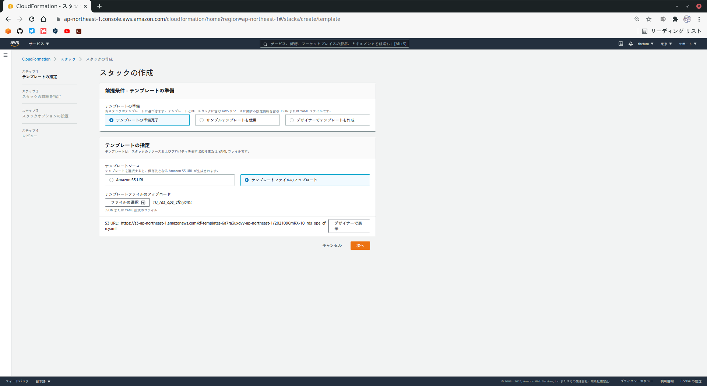
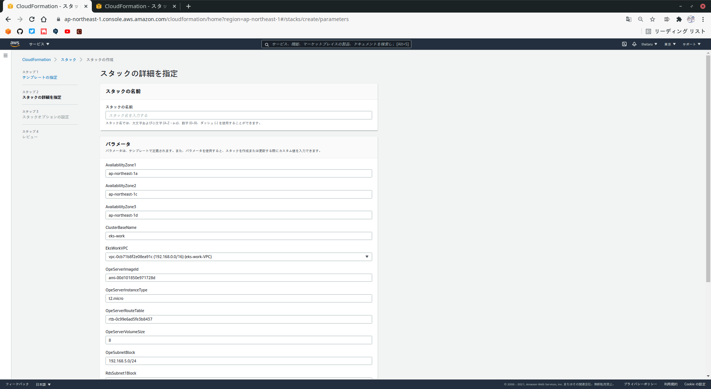
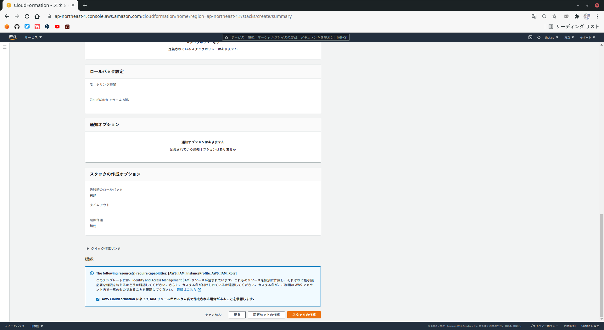
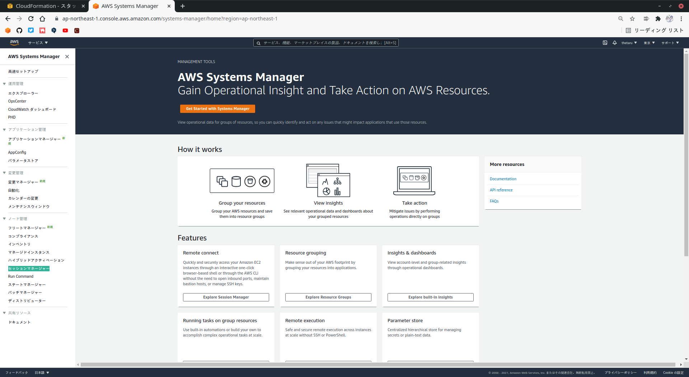
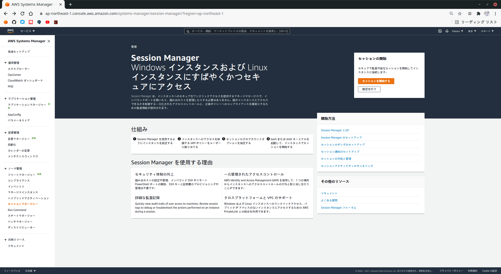
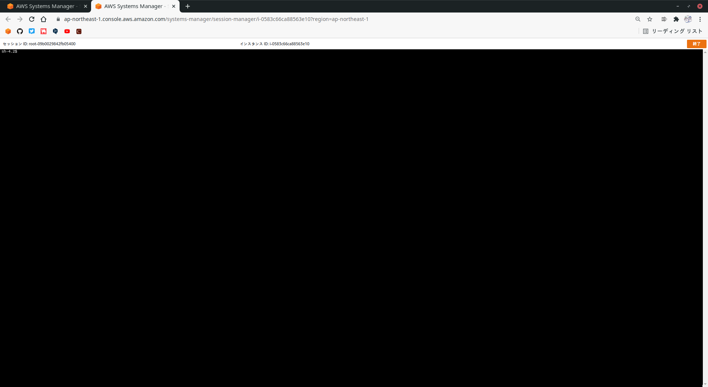
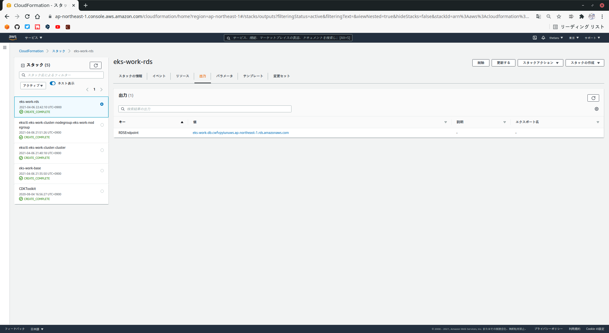
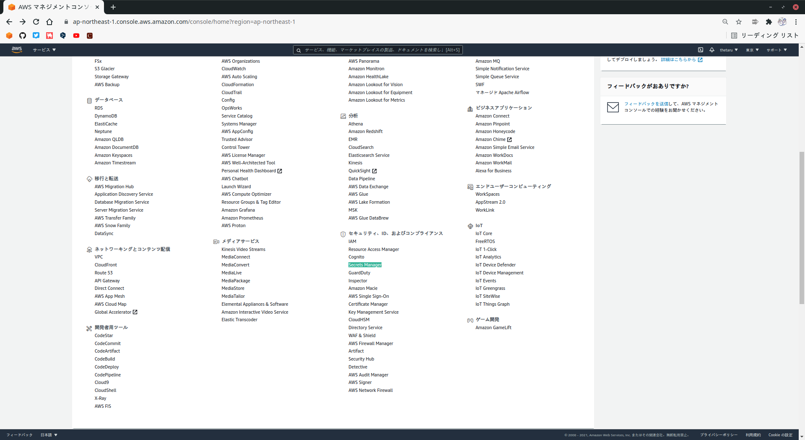

# データベースのセットアップ
## 2-3-1 データベース環境の構築
RDSを用いて、PostgreSQLを構築して利用します。(本番環境では、複数AZに冗長化して構築するのが一般的ですが、今回はシングルAZ構成とします。)  
RDSはAWSが提供するリレーショナルデータベースのマネージドサービスです。  
RDSではデータベースが稼働するOSへのログインができないなどの制限が存在します。
## 2-3-2 データベース環境の構築
データベース環境(RDS及び踏み台サーバ)の構築はCloudFormationで行います。  
CloudFormationテンプレートは`10_rds_ope_cfn.yaml`を利用します。  
マネジメントコンソールのCloudFormationのページを開き、`スタックの作成`-`新しいリソースを使用(標準)`を選び、`スタックの作成`画面を表示します。
  

  
次に、`テンプレートの準備完了`-`テンプレートファイルのアップロード`を選び、`ファイルの選択`で`10_rds_cfn.yaml`を選択し、`次へ`を押します。
  

  
スタックの名前とパラメータ(EksWorkVPC、OpeServerRouteTable)を指定します。  
※ OpeServerRouteTableの値は`eks-work-base`-`出力`の`Route Table`の値です。  
  
`スタックの名前`には`eks-work-rds`と入力してください。  
パラメータの値を入力したら`次へ`を押して次のページに進みます。
  

  
`スタックオプションの設定`は値を変更せず、そのまま`次へ`を押します。
  

  
`レビュー`画面では、テンプレート名及び入力したパラメータ(EksWorkVPC、OpeServerRouteTable)の値を確認してください。   
値の確認とチェックボックスのチェックを終えたら、`スタックの作成`を押してデータベース環境の構築を開始します。
  
マネジメントコンソールでスタックの作成状況を確認し、ステータスが`CREATE COMPLETE`になるまで待ちます。
## 2-3-3 セッションマネージャーによる踏み台サーバへの接続
CloudFormationによるデータベース環境の構築が終わったので、踏み台サーバに接続してみます。  
踏み台サーバへのアクセスはセッションマネージャーを利用します。  
セッションマネージャーは、マネジメントコンソールからEC2インスタンスのコンソールに接続するサービスです。  
`サービス`-`管理とガバナンス`より`Systems Manager`を押します。
  

  
Systems Managerの画面で、画面左側のメニューから`セッションマネージャー`を選びます。
  

  
表示された`セッションマネージャー`画面で`セッションの開始`を押すと、ターゲットインスタンスの候補が表示されます。
  

  
ターゲットインスタンスの候補に表示された踏み台サーバを一覧から選択して`セッションの開始`を押してください。
  

  
セッションマネージャーのセッションを開始すると、Webブラウザ上に踏み台サーバのコンソールが表示されます。
  

  
## 2-3-4 踏み台サーバへのツール導入
踏み台サーバで使用するツールを導入します。以下の2つツールを使用します。
- Git
- PostgreSQLクライアント

### ■ Gitの導入
```
$ sudo yum install -y git
```
### ■ PostgreSQLクライアントの導入
```
$ sudo amazon-linux-extras install -y postgresql10
```
## 2-3-5 GitHubからのクローン
セッションマネージャのコンソールから以下のコマンドを実行します。
```
### ホームディレクトリに移動
$ cd

### /home/ssm-userであることを確認
$ pwd

### クローン開始
$ git clone https://github.com/kazusato/k8sbook.git
```
## 2-3-6 データベースのエンドポイントアドレスと管理者パスワードの確認
データベースに接続する前に、データベースに接続するための情報を確認します。  
マネジメントコンソールを用いて、以下の3つの情報を確認します。
- データベースのエンドポイントアドレス
- データベース管理者用パスワード
- アプリケーション用データベースユーザのパスワード

### ■ データベースのエンドポイントアドレスの確認
データベースのエンドポイントアドレスは、CloudFormationの`出力`より`RDSEndpoint`というキーの値として表示されます。  
データベースに接続する際は、このアドレスを使用します。
  

  
### ■ データベース管理者パスワードの確認
データベースの管理者パスワードは、CloudFormationでデータベース(RDSインスタンス)を構築する際、RDSの管理者パスワードをSecretes Managerが作成し、データベースに登録しています。  
Secrets Managerで作成したパスワードは、マネジメントコンソールのSecrets Managerの画面から確認できます。
  

  
Secrets Managerの画面では、登録されているシークレットの一覧が表示されます。
  

  
データベース環境用のCloudFormationテンプレートでは、`RdsMasterSecret`という名前でデータベース管理者パスワードを登録しています。  
シークレット名のリンクを押して、シークレットの詳細情報より`シークレットの値`の`シークレットの値を取得する`を押すと、シークレットの値を表示できます。
### ■ アプリケーション用データベースユーザのパスワードの確認
上と同様にSecrets Managerから確認できます。`RdsUserSecret`という名前でデータベースユーザパスワードを登録しています。
## 2-3-7 データベース操作
セッションマネージャで以下の操作をします。
- アプリケーション用データベースユーザの作成
- アプリケーション用データベースの作成
- DDLの実行
- サンプルデータの投入

### ■ アプリケーション用データベースユーザの作成
```
$ createuser -d -U eksdbadmin -P -h <RDSエンドポイントアドレス> mywork
```
```
Enter password for new role: <- myworkのパスワード(RdsUserSecretのパスワードを使用する)
Enter it again:              <- myworkのパスワード(RdsUserSecretのパスワードを使用する)
Password:                    <- RdsMasterSecretのパスワード
```
### ■ アプリケーション用データベースの作成
```
$ createdb -U mywork -h <RDSエンドポイントアドレス> -E UTF8 myworkdb
```
### ■ データベースへの接続
```
$ psql -U mywork -h <RDSエンドポイントアドレス> myworkdb
```
### ■ DDLの実行とサンプルデータの投入
```
myworkdb=> \i k8sbook/backend-app/scripts/10_ddl.sql
CREATE TABLE
CREATE TABLE
CREATE TABLE
CREATE TABLE
myworkdb=> \i k8sbook/backend-app/scripts/20_insert_sample_data.sql
INSERT 0 1
INSERT 0 1
INSERT 0 1
INSERT 0 1
INSERT 0 1
INSERT 0 1
INSERT 0 1
INSERT 0 1
INSERT 0 1
INSERT 0 1
INSERT 0 1
INSERT 0 1
myworkdb=> \q
```
