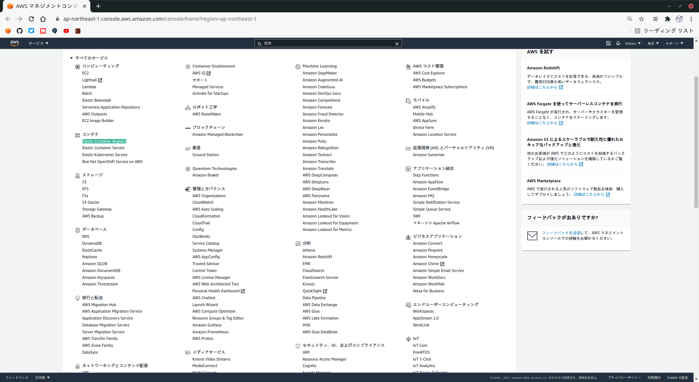
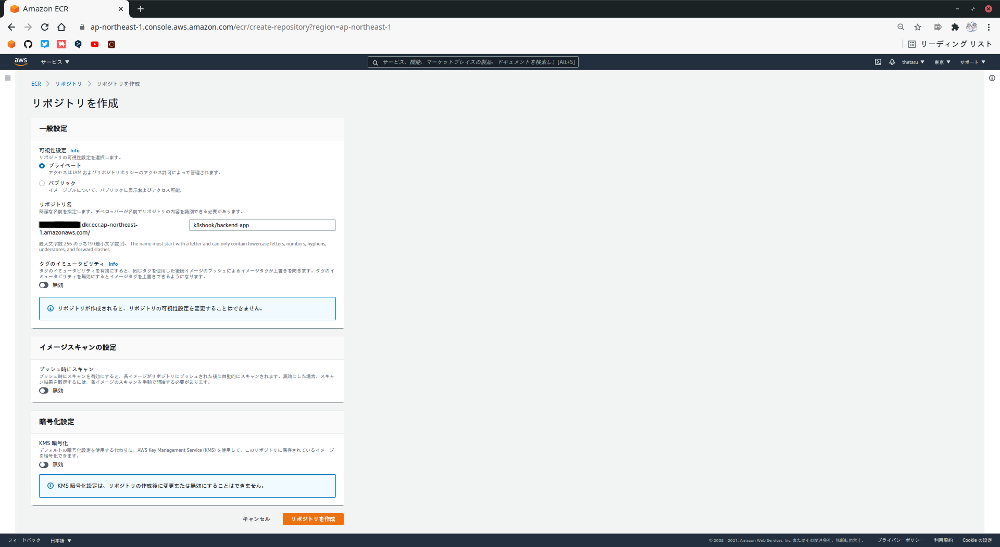
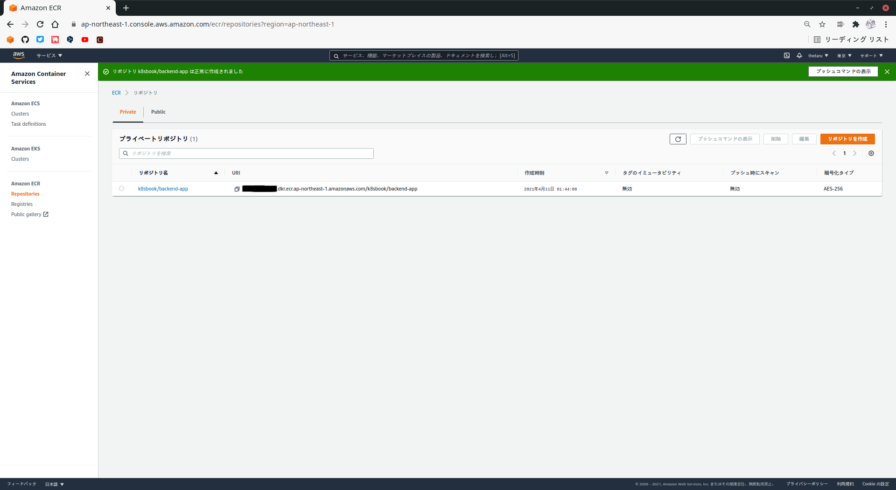

# APIアプリケーションのビルドとデプロイ
サンプルAPIアプリケーションをビルドし、コンテナイメージを作成して、作成したEKSクラスタ上で動作させます。
## 2-4-1 事前準備
APIアプリケーションは、構築したデータベースサーバに接続する3層アプリケーションです。  
作業用端末には、アプリケーションのビルドに必要な開発ツール(OpenJDK)を導入する必要があります。  
また、アプリケーションをEKSクラスタにデプロイするには、コンテナイメージを作成し、それをコンテナレジストリに登録する必要があります。
## 2-4-2 ソースコードのビルドとコンテナイメージの作成
### ■ 作業端末へ Amazon Corretto 11 を導入
以下は、CentOS Streamで実行した際のコマンドです。
```
# rpm --import https://yum.corretto.aws/corretto.key 
# curl -L -o /etc/yum.repos.d/corretto.repo https://yum.corretto.aws/corretto.repo
# yum install -y java-11-amazon-corretto-devel
```
### ■ ソースコードのビルド
サンプルアプリケーションのソースコードは[ここ](https://github.com/kazusato/k8sbook/tree/master/backend-app)からもってきてください。  
ソースコードのビルドは、Javaアプリケーション用のビルドツールであるGradleを使用する構成としています。
```
# cd k8sbook/backend-app
# ./gradlew clean build
```
このコマンドを実行すると、次の内容が実行されます。
- 依存ライブラリのダウンロード
- プログラムのコンパイル
- テストプログラムのコンパイル
- テストの実行
- プログラム実行用のアーカイブファイル(JARファイル)の作成

正常にビルドが完了すると、`BUILD SUCCESSFUL`と表示され、作業ディレクトリ配下`build/libs`以下に`backend-app-1.0.0.jar`が作成されます。
### ■ コンテナイメージの作成
次に、コンテナイメージを作成します。  
コンテナイメージの作成は、Dockerfileを作成して、docker buildコマンドでビルドします。  
Dockerfileは、[ここ](https://github.com/kazusato/k8sbook/tree/master/backend-app)から持ってきてビルドしましょう。
```
# docker build -t k8sbook/backend-app:1.0.0 --build-arg JAR_FILE=build/libs/backend-app-1.0.0.jar .
```
## 2-4-3 コンテナレジストリの準備
作成したコンテナイメージは、作業端末上にしか存在しないため、EKS上にデプロイするには、コンテナレジストリに登録する必要があります。  
AWSではECRというコンテナレジストリサービスを提供しているので、これを利用します。  
ECRを利用するときは、コンテナイメージを登録する前に、コンテナイメージごとに`リポジトリ`を作成しておく必要があります。  
以下、APIアプリケーション用にリポジトリを作成していきます。  
  
それでは、マネジメントコンソールの`コンテナ`より`Elastic Container Registry`を選択します。  
  

  
レジストリを1つも作成していない状態でECRのページを開くと、次のような画面が表示されるので、`リポジトリの作成`より`使用方法`を押してください。  
  

  
次のページでは、リポジトリ名に`k8sbook/backend-app`を指定して、`リポジトリの作成`を押します。  
リポジトリ名の意味は、`k8sbook`という名前空間に属する`backend-app`というコンテナイメージという意味になります。  
画面左側にあるURIは、AWSアカウントごとのECRを指すアドレスとなります。(コンテナイメージのpushやpullをする際に必要となります。)
  

  
正常にリポジトリが作成できると、次のような完了画面が表示されます。  
  

  
## 2-4-4 コンテナイメージのpush
作成したコンテナイメージを作成したコンテナレジストリに登録します。  
登録する前にdocker loginでECRへの認証を通す必要があります。
### ■ ECRへのログイン
ECRんいログインするための認証情報は、AWS CLIから取得できます。  
作業端末で以下のコマンドを実行してください。
```
# aws ecr get-login-password
```
ログインする際は、パスワードを直打ちするとヒストリに残るので以下のようにしましょう。
```
# docker login -u AWS -p $(aws ecr get-login-password) https://<リポジトリのURI>
```
正常にログインできると、`Login Succeeded`と表示されます。
### ■ コンテナイメージのタグ付けとpush
ECRへのログインが完了したら、コンテナイメージを格納します。  
コンテナイメージのpushは、以下の2つの手順で実施します。
- docker tagコマンドでコンテナイメージにタグ付けする
- 付けたタグを指定して、docker pushコマンドを実行する

作成したAPIアプリケーションのコンテナイメージ(k8sbook/backend-app:1.0.0)に対して、ECRのアドレスを含む形のタグを付与します。  
やっていることは、コンテナイメージに別名を付けているだけです。
```
# docker tag k8sbook/backend-app:1.0.0 <リポジトリのURI>/k8sbook/backend-app:1.0.0
```
タグ付けしたら指定したタグに対してdocker pushコマンドを実行します。
```
# docker push <リポジトリのURI>/k8sbook/backend-app:1.0.0
```
すると、指定したタグに従ってECRにコンテナイメージが転送されます。
## 2-4-5 EKSクラスタへのAPIアプリケーションのデプロイ
APIアプリケーションをEKSクラスタにデプロイします。
### ■ Namespaceの作成
k8sでは、1つのクラスタをNamespaceという論理的な区画に分割して管理できます。  
ここでは、サンプルアプリケーション用に`eks-work`というNamespaceを作成し、そのNamespaceにAPIアプリケーションをデプロイします。  
  
Namespaceの作成は、kubectl applyコマンドでマニフェストを適用することで行います。  
一度環境構築を行えば、マニフェストを使用することで何度でも同じ環境を再現できます。  
  
それでは、`eks-work`という名前のNamespaceを作成します。  
マニフェストは[ここ](https://github.com/kazusato/k8sbook/tree/master/eks-env)から持ってきてください。
```
# kubectl apply -f 20_create_namespace_k8s.yaml
```
```
namespace/eks-work created
```
### ■ kubeconfigへのNamespaceの反映
kubeconfigに対して、作成したNamespaceを反映します。  
kubeconfigファイルでは、コンテキストごとにNamespaceを指定することができます。  
現在のコンテキストは以下のとおりです。(CURRENT列に`*`がついている行が、有効なコンテキストです。)
```
# kubectl config get-contexts
```
```
CURRENT   NAME                                                    CLUSTER                                     AUTHINFO                                                NAMESPACE
*         k8seksadmin@eks-work-cluster.ap-northeast-1.eksctl.io   eks-work-cluster.ap-northeast-1.eksctl.io   k8seksadmin@eks-work-cluster.ap-northeast-1.eksctl.io
```
  
Namespace`eks-work`を使用するために、`eks-work`が指定されたコンテキストを作成し、有効化します。  
```
### コンテキストの作成
# kubectl config set-context eks-work \
--cluster <CLUSTER列の値> \
--user <AUTHINFO列の値> \
--namespace eks-work

### コンテキストの有効化
# kubectl config use-context eks-work
```
コンテキストが有効になっていることを確認します。
```
# kubectl config get-contexts
```
```
CURRENT   NAME                                                    CLUSTER                                     AUTHINFO                                                NAMESPACE
*         eks-work                                                eks-work-cluster.ap-northeast-1.eksctl.io   k8seksadmin@eks-work-cluster.ap-northeast-1.eksctl.io   eks-work
          k8seksadmin@eks-work-cluster.ap-northeast-1.eksctl.io   eks-work-cluster.ap-northeast-1.eksctl.io   k8seksadmin@eks-work-cluster.ap-northeast-1.eksctl.io
```
### ■ データベース接続用Secretの登録
APIアプリケーションがデータベースに接続するためのパスワードなどを保存する`Secret`を作成します。  
Secretとは、k8sクラスタの中にパスワードなどの機密情報を保管するためのものです。  
  
Secretの作成には、以下の情報が必要に成ります。(それぞれマネジメントコンソールから取得してください。)
- RDSエンドポイントアドレス
- アプリケーション用データベースユーザのパスワード

これらの値が取得できたら、作業端末より以下のコマンドを実行してください。
```
# DB_URL=jdbc:postgresq://<RDSエンドポイントアドレス>/myworkdb \
DB_PASSWORD='アプリケーション用データベースユーザのパスワード' \
envsubst < 21_db_config_k8s.yaml.template | \
kubectl apply -f -
```
```
secret/db-config created
```
### ■ APIアプリケーションのデプロイ
APIアプリケーションをデプロイします。  
デプロイ用のマニフェストを適用してください。  
```
# ECR_HOST=<リポジトリのURIからリポジトリ名を除く> \
envsubst < 22_deployment_backend-app_k8s.yaml.template | \
kubectl apply -f -
```
```
deployment.apps/backend-app created
```
これでデプロイが実施されました。  
デプロイによって作成されたポッドを見ていきましょう。
```
# kubectl get all
```
```
NAME                             READY   STATUS    RESTARTS   AGE
pod/backend-app-b9664d4c-j56nd   1/1     Running   0          5s
pod/backend-app-b9664d4c-p52h6   1/1     Running   0          5s

NAME                          READY   UP-TO-DATE   AVAILABLE   AGE
deployment.apps/backend-app   2/2     2            2           5s

NAME                                   DESIRED   CURRENT   READY   AGE
replicaset.apps/backend-app-b9664d4c   2         2         2       5s
```
※ 実はヘルスチェックでしくじっている
## 2-4-6 APIアプリケーションの公開
APIアプリケーションのデプロイができましたが、クラスタの外からAPIを呼び出せません。  
LoadBalanceというServiceを使って、インターネットからのリクエストを受け付けてポッド上のアプリケーションを呼び出せるようにします。
```
# kubectl apply -f 23_service_backend-app_k8s.yaml
```
```
service/backend-app-service created
```
Serviceが作成されていることを確認します。
```
# kubectl get all
```
```
NAME                          TYPE           CLUSTER-IP      EXTERNAL-IP                                                                   PORT(S)          AGE
service/backend-app-service   LoadBalancer   10.100.218.65   XXXXXXXXXXXXXXXXXXXXXXXXXXXXXXX-XXXXXXXXX.ap-northeast-1.elb.amazonaws.com   8080:30714/TCP   31s
```
