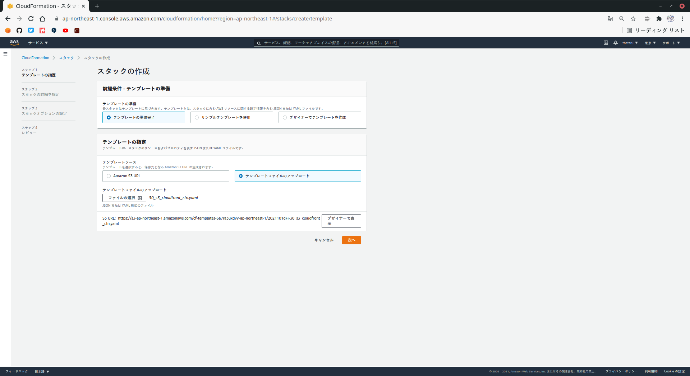
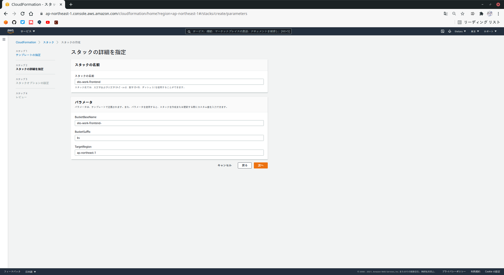

# フロントエンドアプリケーションのビルドとデプロイ
2-4でデプロイしたAPIアプリケーションに接続して使用するフロントエンドアプリケーションのビルドとデプロイを行います。
## 2-5-1 事前準備
サンプルアプリケーションのフロントエンドは、Nuxt.jsで構築されたSPAです。  
SPAをAWSで公開する場合は、S3上にコンテンツを配置し、CloudFront経由でアクセスするのが一般的です。
### ■ 作業端末へ Node.js を導入
node.jsの[公式サイト](https://github.com/nodesource/distributions)よりLTS版をインストールします。
```
# curl -fsSL https://rpm.nodesource.com/setup_lts.x | bash -
```
動作確認をします。
```
# node --version
```
## 2-5-2 フロントエンドアプリケーションのビルド
作業端末で、フロントエンドアプリケーションの資材が置かれたフォルダに移動してください。
```
# cd k8sbook/frontend-app/
```
### ■ ライブラリの取得
はじめにフロントエンドアプリケーションで使用するライブラリを取得します。  
※ package.jsonに記述されているライブラリを取得します。
```
# npm install
```
```
# npm update
```
※ 場合によっては、`gcc-c++`をインストールする必要があります。
### ■ APIのベースURLの確認
サンプルアプリケーションのフロントエンドでは、ビルドの際にAPIにアクセスするためのベースURLを指定し、その値をプログラムに埋め込む仕組みになっています。  
LoadBalancerの`EXTERNAL-IP`列の値を確認しましょう。
```
# kubectl get service
```
```
NAME                          TYPE           CLUSTER-IP      EXTERNAL-IP                                                                   PORT(S)          AGE
service/backend-app-service   LoadBalancer   10.100.218.65   XXXXXXXXXXXXXXXXXXXXXXXXXXXXXXX-XXXXXXXXX.ap-northeast-1.elb.amazonaws.com   8080:30714/TCP   31s
```
### ■ ビルドの実行
フロントエンドアプリケーションのビルドを行います。  
ビルドは以下のコマンドで実行できます。
```
# BASE_URL=http://<EXTERNAL-IPの値>:8080
# npm run build
```
ビルド結果のファイルはdistフォルダの下に出力されます。  
このフォルダをWebサーバに配置すると、フロントエンドアプリケーションを公開することができます。
## 2-5-3 S3バケットとCloudFrontディストリビューションの作成
コンテンツファイルを配置するS3バケットと、それを配信するためのCloudFrontディストリビューションを、CloudFormationで作成していきます。  
  
マネジメントコンソールからCloudFormationを開き、`スタックの作成`-`新しいリソースを使用(標準)`を押し、`テンプレートファイルのアップロード`から`30_s3_cloudfront_cfn.yaml`を選択して`次へ`を押します。  
  

  
`スタックの詳細を指定`画面では、スタックの名前を`eks-work-frontend`と指定し、パラメータ-BuchetSuffixに任意の文字列(ここではksを使用)を入力して`次へ`を押してください。  
※ BucketSuffixは一意(他の人とかぶらないように)しなければなりません。
  

  
次の`スタックオプションの設定`画面と`レビュー`画面では変更は不要なので`次へ`を押して進みます。  
スタックの作成を開始したら、マネジメントコンソールのCloudFormation画面でステータスを確認し、`CREATE_COMPLETE`になるのを待ちます。
## 2-5-4 コンテンツのアップロード
S3バケットに、フロントエンドアプリケーションのコンテンツをアップロードしましょう。
