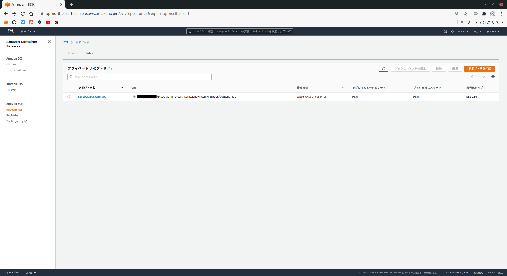
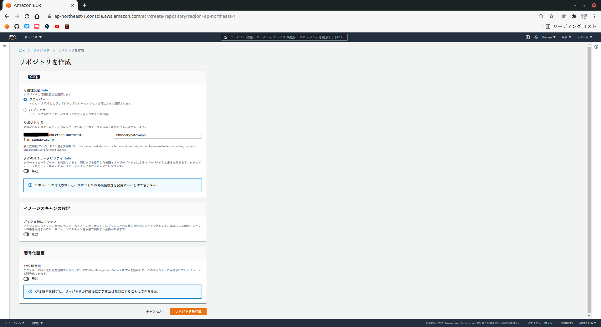
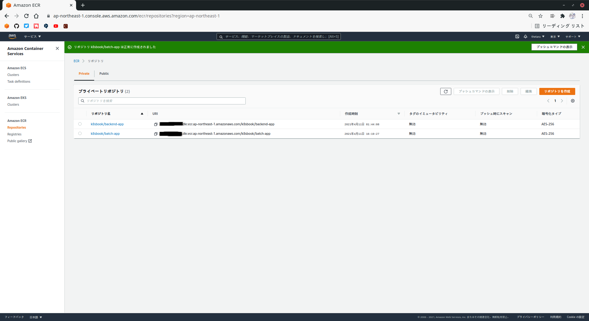
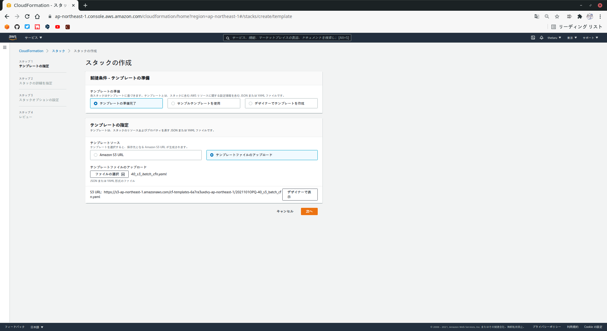
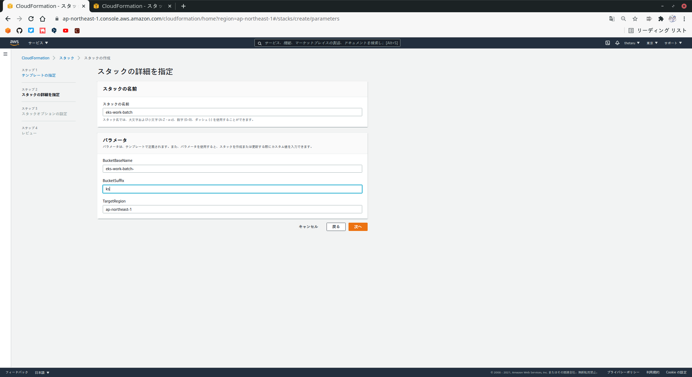
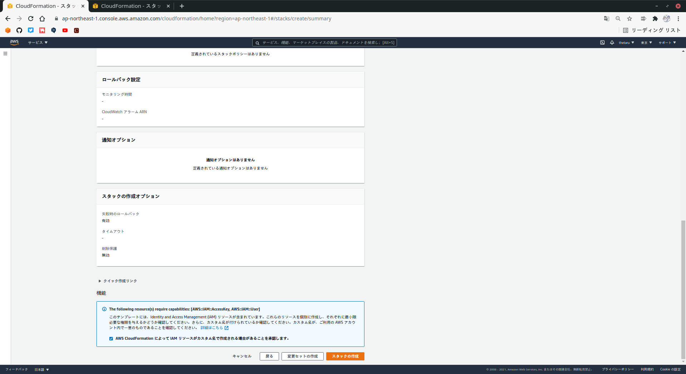
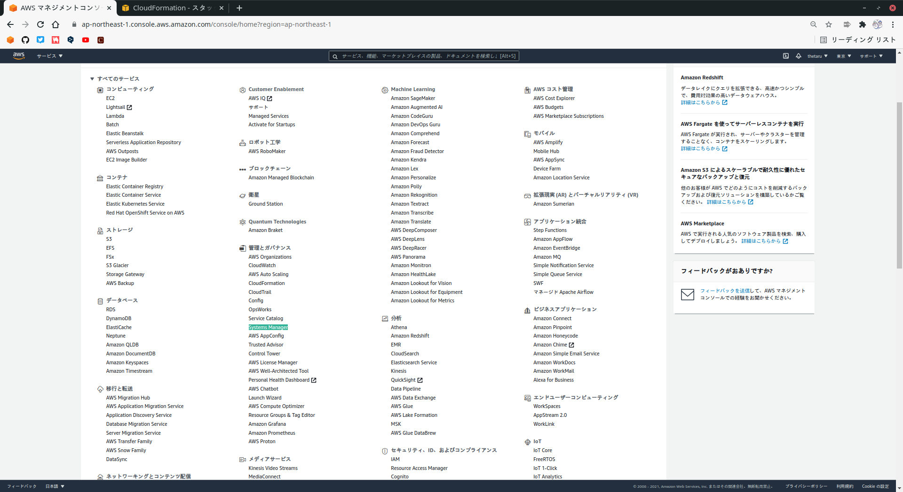
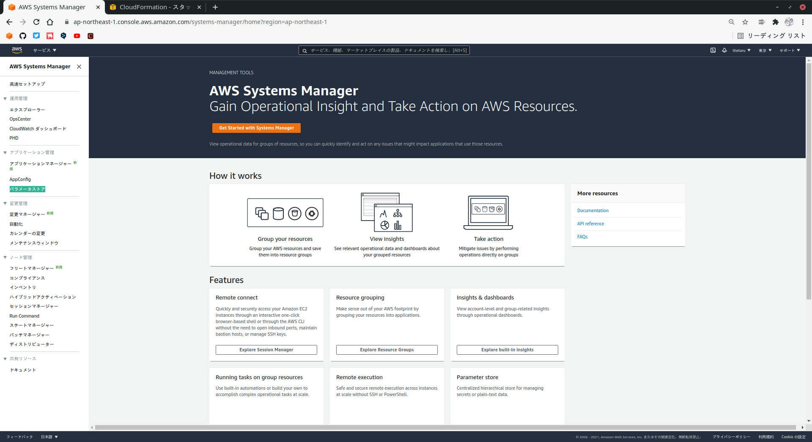
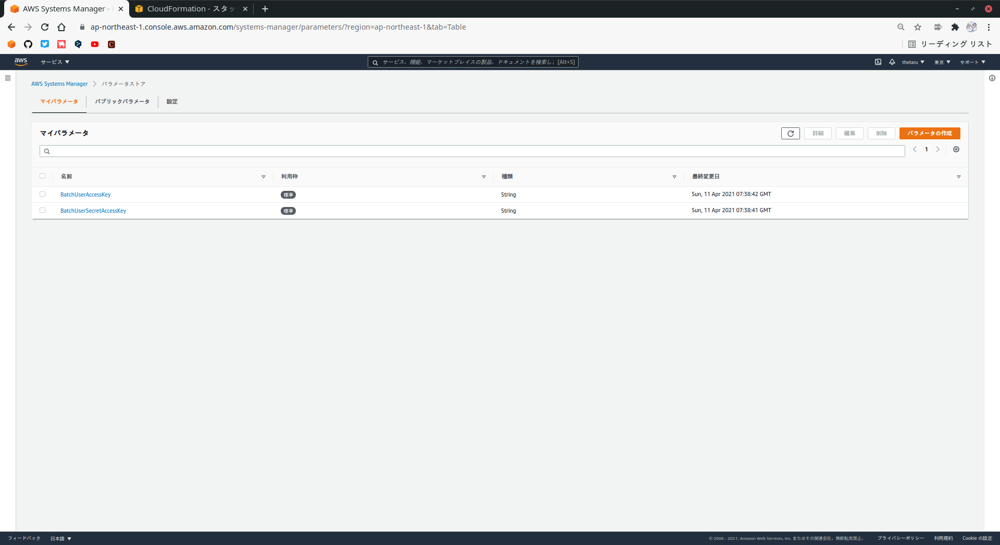

# バッチアプリケーションのビルドとデプロイ
スケジュール起動されるバッチアプリケーションのビルドとデプロイを行います。
## 2-6-1 事前準備
バッチアプリケーションは、APIアプリケーションと同様、JavaでSprint Bootを使用して構築されたアプリケーションです。  
アプリケーションが起動すると、環境変数で指定されたS3バケット上のファイルを取得し、ファイルの内容をデータベースに登録します。  
このときアクセスするバケットは、フロントエンドコンテンツを配置したバケットとは異なり、特定のユーザしかアクセスできない設定とします。  
  
このアプリケーションをk8sのCronJobという仕組みを用いて、定期実行させます。
## 2-6-2 バッチアプリケーションのビルドとコンテナイメージの作成
バッチアプリケーションのソースコードをビルドし、コンテナイメージを作成します。
### ■ ソースコードのビルド
バッチアプリケーションのソースコードは、[ここ](https://github.com/kazusato/k8sbook/tree/6d9d359fcf1cad348715fd2e6fe8e35cde725df7/batch-app)からもってきてください。  
バッチアプリケーションは、APIアプリケーション同様、Gradleでビルドを行います。
```
# cd k8sbook/batch-app
# ./gradlew clean build
```
正常にビルドが行われると`BUILD SUCCESSFUL`と表示され、作業フォルダ配下の`build/libs`以下に`batch-app-1.0.0.jar`ファイルが作成されます。
### ■ コンテナイメージの作成
コンテナイメージを作成します。
```
# docker build -t k8sbook/batch-app:1.0.0 --build-arg JAR-FILE~build/libs/batch-app-1.0.0.jar .
```
## 2-6-3 ECRレポジトリの作成
作成したコンテナイメージをECR上に登録するため、バッチアプリケーション用のリポジトリを作成します。  
マネジメントコンソールの`コンピューティング`から`Elastic Container Registry`を開き、`リポジトリの作成`を押してください。  
  

  
`リポジトリ名`に`k8sbook/batch-app`と入力し、`リポジトリの作成`を押します。
  

  
正常に作成できると、次のような画面が表示されます。
  

  
## 2-6-4 コンテナイメージのpush
2-4-4と同様です。細かい説明は省きます。
### ■ ECRへのログイン
```
# docker login -u AWS -p $(aws ecr get-login-password) https://<リポジトリのURI>
```
### ■ コンテナイメージのタグ付けとpush
```
# docker tag k8sbook/batch-app:1.0.0 <レポジトリのURI>:1.0.0
# docker push <レポジトリのURI>:1.0.0
```
## 2-6-5 S3バケットの作成
バッチアプリケーションが利用するS3バケットを作成します。  
マネジメントコンソールからCloudFormationを開き、`スタックの作成`-`新しいリソースを使用(標準)`を押し、`テンプレートファイルのアップロード`から`40_s3_batch_cfn.yaml`を選択して`次へ`を押します。  
  

  
`スタックの詳細を指定`画面では、スタックの名前を`eks-work-batch`と指定し、パラメータ-BuchetSuffixに任意の文字列(ここではksを使用)を入力して`次へ`を押してください。  
※ BucketSuffixは一意(他の人とかぶらないように)しなければなりません。
  

  
`スタックオプションの設定`画面は変更は不要なので`次へ`を押して進みます。  
  
`レビュー`画面では、構成を確認して問題なければ`AWS CloudFormationによってIAMリソースがカスタム名で作成される場合があることを承認します。`にチェックを入れ、`スタックの作成`を押します。
  

  
スタックの作成が開始されたら、マネジメントコンソールのCloudFormation画面でステータスを確認し、`CREATE_COMPLETE`になるのを待ちます。  
これでバッチアプリケーション用のS3バケットが作成されました。
### ■ 2-6-6 ConfigMapの作成
バッチアプリケーションの設定値を格納するConfigMapを作成します。  
ConfigMapは、k8sで設定値を保持するための仕組みです。  
ここでは、先ほど作成したS3バケットの名称やS3内のフォルダ名などを保持するConfigMapを登録します。  
  
ConfigMapはkubectlで設定できますが、バケット名のサフィックスを指定する必要があるので、envsubstを利用した以下のコマンドを実行してください。
```
# BUCKET_SUFFIX=<BucketSuffixの値> \
envsubst < 41_config_map_batch_k8s.yaml.template | \
kubectl apply -f -
```
## 2-6-7 S3アクセス用アクセスキーの取得とSecretの作成
バッチアプリケーションでは、S3からファイルを取得して利用します。  
バッチアプリケーションがアクセスするS3バケットは、特定の許可されたユーザからしかアクセスできない設定とするので、バッチアプリケーションにはS3にアクセスするための認証情報を渡しておく必要があります。  
  
APIアプリケーションの場合と同様に、機密情報を管理するためのk8sリソースであるSecretを使用します。
### ■ アクセスキーの取得
Secretを作成する前に、認証情報を取得します。  
`管理とガバナンス`より`Systems Manager`を押します。
  

  
画面左側のメニューより`パラメータストア`を開きます。
  

  
すると、`BatchUserAccessKey`と`BatchUserSecretAccessKey`の2つの値が登録されていることがわかります。  
  

  
それぞれの`名前`欄のリンクをクリックすると、詳細情報が表示され、`値`欄に登録されている値が表示されます。
  

  
### ■ Secretの作成
Secretを作成します。Secretはパスワードなどの機密情報を扱うときに使うリソースです。  
先ほどパラメータストアから取得したアクセスキー、シークレットアクセスキーを指定して、以下のコマンドを実行してください。
```
# AWS_ACCESSKEY=<アクセスキー> \
AWS_SECRETKEY=<シークレットアクセスキー> \
envsubst < 42_batch_secrets_k8s.yaml.template | \
kubectl apply -f -
```
```
secret/batch-secret-config created
```
## 2-6-8 入力ファイルの配置
AWS CLIを使って、バッチアプリケーションが利用する入力ファイルをバケットにアップロードしましょう。
```
# aws s3 sync ../batch-app/sample_data/normal s3://eks-work-batch-<BucketSuffixの値>/locationData --delete --include "*" --acl public-read
```
