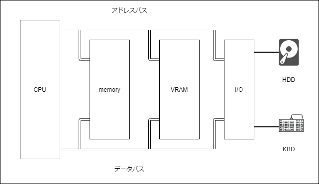

# 3.1 プログラムの配置
## 3.1.1 配置場所の特性
CPUはメモリ上のプログラムのみ実行できます。  
主記憶装置(メモリ)は揮発性をもつため、電気の供給を断つと記憶内容が消失してしまいます。  
そのため、CPUに実行される前のプログラムは不揮発性メモリである補助記憶装置(HDDやSSD)に配置します。

## 3.1.2 プログラムの実行
補助記憶装置に配置した(機械語)プログラムをCPUに実行するには、まずプログラムを主記憶装置に移動させる必要があります。  
その役割はプログラムローダが担当し、補助記憶装置から主記憶装置へ読み出します。  
その後、プログラムローダは読み出したプログラムの先頭へジャンプし、目的のプログラムを実行します。

## 3.1.3 プログラムローダのパラドックス
プログラムローダもプログラムであるため、CPUによって実行される機械語プログラムです。  
プログラムローダ自身も補助記憶装置に格納されるので、誰がプログラムローダを補助記憶装置から主記憶装置に読み出すのでしょうか?  

## 3.1.4 BIOSの役割
実はBIOSがプログラムローダを主記憶装置に読み出しています。  
BIOSは不揮発性の記憶装置(マザボ上のROM)に書き込まれており、CPUにメモリと同列に接続されます。  
そのため、CPUからメモリと同様にアクセスでき、コンピュータに電源を入れた直後からそのまま実行することができます。  
BIOSには、補助記憶装置からOSをメモリ上に読み出し、そこへジャンプするようなプログラムが書き込まれており、これがプログラムローダの連鎖の起点となります。  
※ OSを読みだした際にプログラムローダも読み出される認識でOK?

## 3.1.5 データの格納方式
機械語プログラムはさまざまな形式で補助記憶装置に格納されます。  
一番簡単なのは、機械語プログラムそのままのバイト列を格納する方法です。  
この方法をRaw Binaryといいます。(補助記憶装置にMBRという特殊な領域に書き込むのに使います)  
機械語列そのままのデータなので、メモリに読み出して先頭にジャンプするだけで実行できます。

## 3.1.6 実行ファイルの形式
WindowsならPE形式、MacならMach-O形式、Unix系ならELF形式が主流となります。  
いずれの形式も機械語列のバイト列にヘッダを付与したファイルとなっています。  
ヘッダ部分には、機械語のバイト数や各セクションのサイズなどの管理情報が含まれており、それぞれのOSでソフトウェアの動作を管理するのに使います。  
  
どの実行可能ファイルの形式であっても、基本的にメモリの特定の番地に配置する必要があります。  
もしずれた位置に配置すると、メモリ番地を扱う命令がうまく動作しなくなります。

## 3.1.7 org疑似命令について
これまで、アセンブリ言語で書かれたプログラムは0番地から配置されることになっていましたが、実は先頭の番地を変更するための機能があります。  
その機能を持つのがorg疑似命令で、プログラムの配置場所をアセンブラに伝える役割があります。  
例えば、`org 0x7c00`と書けば、そのプログラムを0x7c00に配置したときにうまく動くように、アセンブラがラベルの番地を計算します。
  
ちなみに、0x7c00はBIOSが補助記憶装置のMBRから読み出したプログラムを配置する標準的な番地です。  
したがって、[このプログラム](https://github.com/thetaru/memorandum/blob/master/Summary/jisaku_emulator/3/HelloWorld.asm)をアセンブルしてMBRに書き込み、パソコンを起動させれば、OSの力を借りずにハローワールドできます。

## 3.1.8 物理アドレスと論理アドレス
今やどんなパソコンでもマルチタスクに対応しており、同時に複数のプログラムを実行できます。  
しかし、メモリは1つしかなく、特定の番地を持つメモリ領域はただ1つなのに、プログラムの配置場所は競合しないのでしょうか?  
  
1つのパソコンで複数のプログラムを同時に動かせるのは、CPUに備わっているアドレス変換という機能のおかげです。  
プログラムから見たメモリ番地(論理アドレス)と、CPUがアクセスするメモリ番地(物理アドレス)を変換することで競合を避ける仕組みとなっています。  
  
例えば、プログラムAは物理アドレスの0x100000に、プログラムBは物理アドレスの0x200000に配置されているが、プログラムから見たら(つまり論理アドレスとして見ると)どちらも0x400000番地から配置されているという状況が作れます。

## 3.1.9 アドレス空間
アドレス空間とは、番地の空間のことで、0x00000000番地から0xffffffff番地までの全番地の集合と思ってよいです。  
  
アドレス変換のない世界では、プログラムがメモリを見るときのアドレス空間`論理アドレス空間`と、CPUがメモリを見るときのアドレス空間`物理アドレス空間`が一致します。(それはそう)

|セグメント名|論理アドレス空間|物理アドレス空間|
|:---|:---|:---|
|プログラムA.text|0x00400000-0x0047ffff|0x00100000-0x0017ffff|
|プログラムA.data|0x00000000-0x0007ffff|0x00180000-0x001fffff|
|プログラムB.text|0x00400000-0x0047ffff|0x00200000-0x0027ffff|
|プログラムB.data|0x00000000-0x0007ffff|0x00280000-0x002fffff|

アドレス変換がある世界では、論理アドレス空間と物理アドレス空間の対応表をCPUが持ちます。  
上の表がセグメンテーション方式の変換表(の例)です。  
セグメント名は個々の変換設定の名前で、ある変換設定は論理アドレス空間と物理アドレス空間の対応関係を1つ示します。
  
プログラムAもBも機械語(.textセクションの内容)が0x00400000に置かれているので、`org 0x00400000`とすればラベルの番地がずれることなく動きます。

### 3.1.9.1 例
プログラムAに0x20(論理アドレス)にアクセスしてくれと頼んだら、変換表に従って変換され、0x180020(物理アドレス)にアクセスすることになります。
  
CPUは変換表を使ってアドレスを変換することはできますが、変換表そのものを作ることはできません。  
変換表の作成・管理はOSの役割で、作成した変換表はCPUへ渡されます。(OS自身はアドレスの変換機能を利用せずにメモリを読み書きします。)  
プログラムがさらにメモリを必要とすると、OSは物理メモリの空き部分を探して確保し、プログラムの論理アドレス空間に割り当てます。  

## 3.1.10 セグメンテーション/ページング
アドレス変換機能は、セグメンテーションとページングというCPUの一機能を使って実現しています。

### 3.1.10.1 セグメンテーション
セグメンテーションは、物理メモリをいくつかの区画(セグメント)に分け、1つのプログラムを1つのセグメントに格納します。  
プログラムから見える0x00番地は、実際にはセグメントの先頭アドレスを表します。  
※ 以下、物理メモリ空間の区画をセグメントという

### 3.1.10.2 ページング
ページングは、論理アドレス空間を小さな同じ大きさの区画(ページ)に分け、ページ単位で物理メモリを割り当てます。  
プログラムからは、ページを意識せず論理アドレス空間全体に自分専用のメモリが存在するように見えます。  
※ 以下、論理アドレス空間の区画をページという

### 3.1.10.3 ページテーブルの例
プログラムAやBからは0x00001000から0x003fffffまでのメモリも存在するように見えますが、実際は物理メモリが割り当てられておらず、メモリ容量を消費しません。  
※ 32bitエミュレータなのでプログラムからは4GBのメモリが割り当てられているように見える   
※ プログラムからのメモリ要求に応じてマッピングを行いページテーブルに割り当てるイメージでOK？

#### プログラムA用のページテーブル

|ページ番号|論理アドレス|物理アドレス|
|:---|:---|:---|
|0|0x00000000|0x00180000|
|1|0x00001000|未割り当て|
|2|0x00002000|未割り当て|
|...|...|...|
|1023|0x003ff000|未割り当て|
|1024|0x00400000|0x00100000|
|1025|0x00401000|未割り当て|
|...|...|...|

#### プログラムB用のページテーブル

|ページ番号|論理アドレス|物理アドレス|
|:---|:---|:---|
|0|0x00000000|0x00280000|
|1|0x00001000|未割り当て|
|2|0x00002000|未割り当て|
|...|...|...|
|1023|0x003ff000|未割り当て|
|1024|0x00400000|0x00200000|
|1025|0x00401000|未割り当て|
|...|...|...|

# 3.2 エミュレータのorg対応
3.1項で説明したorg疑似命令をエミュレータに組み込みます。  
パソコンのBIOSはプログラムを0x7c00番地に配置するので、エミュレータもそれに倣います。  
※ 現状のエミュレータは、memory配列の先頭に読み込むプログラムとなっています

## 3.2.1 機械語プログラム対応
org疑似命令でプログラムの格納場所を変更します。
```asm
BITS 32
    org 0x7c00
    mov eax, 41
    jmp 0
```
`org 0x7c09`を指定したので、0x00番地へのジャンプ命令も`jmp 0`に変更となりました。

## 3.2.2 エミュレータ対応
まず、エミュレータが受け取る機械語ファイルを0x7c00番地へ読み込むようにします。  
ジャンプ命令であるショートジャンプ(short_jump)では、現在位置から-127、+128の範囲のジャンプしかできないので狭すぎます。  
つまり、0x7c00番地から0x00番地へのジャンプはショートジャンプで対応できないため、拡張したジャンプ命令のニアジャンプを定義します。  
※ やることは8bitから32bitへ拡張です  

#### 補足事項: オペコードの確認方法 (かなり重要)
オペコードの16進数表記は、機械語プログラムを逆アセンブルすることで見ることができます。  
※ 今回の場合だと、ファイル修正してmakeしてからのobjdumpって感じ
  
```c
void near_jump(Emulator* emu)
{
  int32_t diff = get_sign_code32(emu, 1);
  emu->eip += (diff + 5);
}

...

void init_instructions(void)
{
  ...
  instructions[0xE9] = near_jump;
  instructions[0xEB] = short_jump;
}
```
`org 0x7c00`によって0x7c00番地にプログラムが配置されるため、機械語プログラムの読み込み先とeipの初期値も変更します。  
```c
int main(int argc, char* argv[])
{
  ...
  /* eip(次の実行番地)の初期値に0x7c00を与えます */
  emu = create_emu(MEMORY_SIZE, 0x7c00, 0x7c00);
  ...
  /* memory配列の先頭(つまり0x00番地)ではなく0x7c00番地から機械語を配置します */
  fread(emu->memory + 0x7c00, 1, 0x200, binary);]
  fclose(binary);
  ...
}
```

## 3.2.3 実行
修正後、makeでhelloworldプログラムとエミュレータを作りなしてから以下を実行してください。
```
# ./px86 helloworld.bin
```
```
EIP = 7C00, Code = B8
EIP = 7C05, Code = E9


end of program.

EAX = 00000029
ECX = 00000000
EDX = 00000000
EBX = 00000000
ESP = 00007c00
EBP = 00000000
ESI = 00000000
EDI = 00000000
EIP = 00000000
```
前回同様の結果になっていたら成功です。

## 3.3 プログラムの実行
この節では、メインメモリに配置されたプログラムをCPUが実行する過程を説明します。  
対象とするのはx86アーキテクチャの代表的なCPUであるi386です。  
  
過程は大きく3段階あり、フェッチ、デコード、実行と呼びます。  
CPUがメインメモリから命令を読み込む`フェッチ`、命令を解釈する`デコード`、そして最後の`実行`です。  
  
CPUは、内蔵するレジスタや加算器、論理演算器などを使い、これら一連の過程を繰り返します。  
まずはCPUの内部構造を説明してから、プログラムの実行過程を説明します。

### 3.3.1 レジスタ
|汎用レジスタ名|別名|役割|
|:---|:---|:---|
|eax|アキュムレータ|値を累積する|
|ebx|ベース|メモリ番地を記憶する|
|ecx|カウンタ|文字列の添え字やループの回数を数える|
|edx|データ|I/O装置の番地を記憶する|
|esi|ソースインデックス|入力データの添字を記憶する|
|edi|デスティネーションインデックス|出力データの添字を記憶する|
|esp|スタックポインタ|スタックの先頭を指す|
|ebp|ベースポインタ|スタック上の何らかのデータを指す|

※ 四則演算などの計算に使います

|特殊レジスタ名|別名|役割|
|:---|:---|:---|
|eip|命令ポインタ|現在実行中の命令の番地を記憶する|
|flags|フラグレジスタ|演算結果やCPUの状態などを表す|

### 3.3.2 CPUとメモリの関係
CPUとメモリや周辺機器(HDDやキーボード)の関係は次の図のようになっています。   
  

  
CPUから出たアドレスパスとデータバスが、その他の装置に接続されてることが重要です。  
CPUはこれらのバスを介して、メモリや周辺機器などとデータをやり取りします。

#### 3.3.2.1 アドレスバス
アドレスバスは、CPUがその装置の何番地を読み書きするかを指示するのに使用します。

#### 3.3.2.2 データバス
データバスは、実際のデータが流れます。

#### 3.3.2.3 VRAM
一般的なPC/AT互換機では、0xa0000から0xaffffまでの領域は特殊なメモリであるVRAM(video RAM)に接続されており、その範囲への書き込みはディスプレイの表示に影響を与えます。

### 3.3.3 プログラムの実行過程
CPUはeipレジスタに格納された番地のメモリ領域から機械語命令のバイト列を読み取り(fetch)、読み取った命令を解釈し(decode)、最後に実行します(execute)。  

### 3.3.4 機械語命令の構造(再)
機械語命令の構造は次のようになっているのでした。
|プレフィックス|オペコード|ModR/M|SIB|ディスプレースメント|イミディメイト|
|:---|:---|:---|:---|:---|:---|
|0~4バイト|1,2,3バイト|0,1バイト|0,1バイト|0,1,2,4バイト|0,1,2,4バイト|

#### 3.3.4.1 オペコード
オペコードは命令の種類を表し、命令によって1バイトから3バイトの間で可変です。  
※ 今まで登場した命令はすべて1バイトのオペコードを持つ命令でした

#### 3.3.4.2 ModR/M
オペランドを柔軟に指定するのが主な役割で、オペコードの種類により要不要が決まります。  

#### 3.3.4.3 ディスプレースメント
レジスタと組み合わせてメモリ番地を指定し、ディスプレースメントはModR/Mの値により要不要が決まります。
